# Práctica 1: Creación de un usuario en IAM y asignación de políticas

## 🎯 Objetivos:
Al finalizar la pr√°ctica, ser√°s capaz de:
- Crear un nuevo usuario IAM con acceso restringido a los servicios utilizados por ingenieros de datos, incluyendo su integración en un grupo IAM con una política personalizada. Todo se realizará en la región **us-west-2 (Oregón)**.

## üìù Requisitos previos:
- Acceso a una cuenta de AWS con permisos administrativos (por ejemplo: rol `AdministratorAccess`).
- Navegador web moderno con conexión a internet.
- Conocimiento b√°sico de la consola de AWS.

## 🕒 Duración aproximada:
- 20 minutos

## 📍 Región de AWS:
- us-west-2 (Oregón)

---

**[⬅️ Atrás](https://netec-mx.github.io/TPRACT_INGDAT_Priv/Capítulo8/lab14.html)** | **[Lista general](https://netec-mx.github.io/TPRACT_INGDAT_Priv/)** | **[Siguiente ➡️](https://netec-mx.github.io/TPRACT_INGDAT_Priv/Capítulo3/lab2.html)**

---

## üìã Instrucciones:

### Tarea 1: Iniciar sesión en la consola de AWS.

**Descripción:** Accede como usuario IAM.

- **Paso 1.** Dirígete a [AWS Console](https://aws.amazon.com/console).

- **Paso 2.** Haz clic en **Sign in**.

- **Paso 3.** Inicia sesión con:

  - **Account ID or alias:** `Cuenta asignada en el curso`
  - **IAM username:** `Asignado en el curso`
  - **Password:** `Asignada en el curso`

- **Paso 4.** Verifica que estás en la región `us-west-2`.

  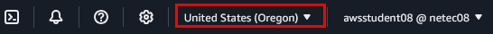  

> **TAREA FINALIZADA**

### Resultado esperado:
Obtendr√°s el acceso exitoso a la consola.

---

### Tarea 2: Crear grupo IAM con políticas personalizadas.

**Descripción:** Crea el grupo `DataEngineers` con una política personalizada que limite el acceso a un bucket S3 específico y agrega las políticas administradas de Glue y Redshift.

- **Paso 1.** En la barra de b√∫squeda superior, escribe `IAM` y selecciona el servicio.

  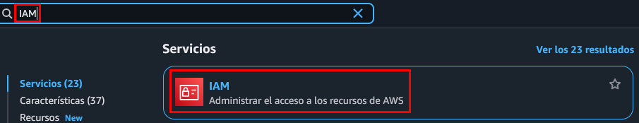

- **Paso 2.** En el men√∫ izquierdo, haz clic en **"User groups"** y luego en **"Create group"**.

  
  
  ---

  

- **Paso 3.** Escribe como nombre del grupo: `DataEngineers`

  

- **Paso 4.** Haz clic en **"Create user group"** al final de la p√°gina.

  

- **Paso 5.** Haz clic en el nombre del grupo para entrar a las propiedades del grupo.

  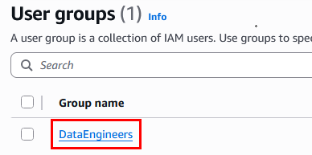

- **Paso 6.** En la pestaña **"Permissions"**, haz clic en **"Add permissions"** y luego en **"Create inline policy"**.

  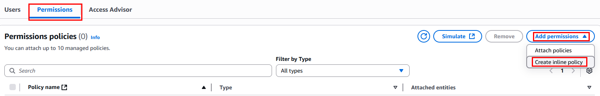

- **Paso 7.** Pega la siguiente política personalizada en un **Bloc de notas** para editarla. **Sustituye** el nombre del bucket en la política por el que se te asignó en el curso.

  ```json
  {
    "Version": "2012-10-17",
    "Statement": [
      {
        "Effect": "Allow",
        "Action": ["s3:ListBucket", "s3:GetObject"],
        "Resource": [
          "arn:aws:s3:::lab-databucket-xxxxxxx",
          "arn:aws:s3:::lab-databucket-xxxxxxx/*"
        ]
      }
    ]
  }
  ```
  ---
  
  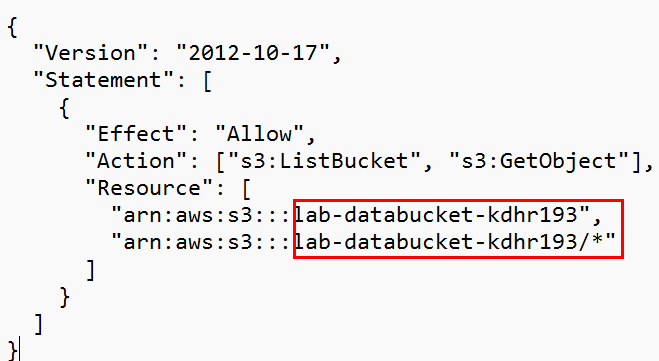

- **Paso 8.** Una vez editada la política, cópiala y regresa a la consola de edición de la política de IAM. Haz clic en **JSON**, **borra** el **contenido** actual de la política y **pega la nueva.**

  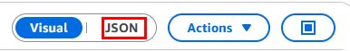
  
  ---
  
  

- **Paso 9.** Haz clic en **"Next"** y asigna como nombre de la política: `S3Access-DataIngest-Bucket`.

  

- **Paso 10.** Finalmente, haz clic en el botón **Create policy**.

- **Paso 11.** En la misma pestaña **Permissions**, haz clic en **Add permissions** y luego en **Attach policies**.

  

- **Paso 12.** Selecciona las políticas administradas:
  
  - `AWSGlueConsoleFullAccess`
  - `AmazonRedshiftReadOnlyAccess`

  
  
  ---
  
  

- **Paso 13.** Haz clic en el botón **Attach policies**.

> **TAREA FINALIZADA**

### Resultado esperado:
Grupo IAM `DataEngineers` creado con acceso √∫nicamente al bucket `lab-databucket-xxxxxxx`, con permisos completos para Glue y solo de lectura para Redshift.

---

### Tarea 3: Crear un nuevo usuario y asociarlo al grupo.

**Descripción:** Crea el usuario `data_engineer_lab` y asígnalo al grupo `DataEngineers`.

- **Paso 1.** En el servicio **IAM**, ve a **"Users"** y haz clic en **"Create user"**.

  

- **Paso 2.** En **User name**, escribe: `data_engineer_lab`.

  

- **Paso 3.** Marca la opción: **"Provide user access to the AWS Management Console"**.

  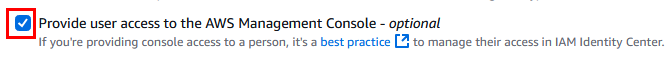

- **Paso 4.** Selecciona **Custom password** y define una contraseña segura (por ejemplo: `Datos2025!`).

  

- **Paso 5.** Desmarca la casilla **"Users must create a new password at next sign-in - Recommended"** y haz clic en **Next**.

  

- **Paso 6.** En la sección **Set permissions**, selecciona **"Add user to group"** y marca el grupo **`DataEngineers`**. Finalmente, haz clic en **Next**.

  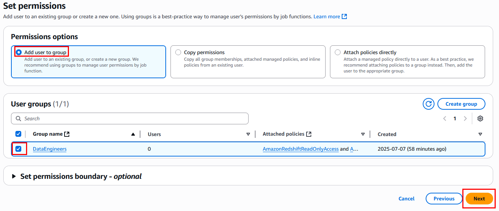

- **Paso 7.** En la sección **Review and create**, añade las siguientes etiquetas:

  - `Key: Project` | `Value: DataLakePOC`  
  - `Key: Role`    | `Value: DataEngineer`  
  - `Key: Region`  | `Value: us-west-2`

  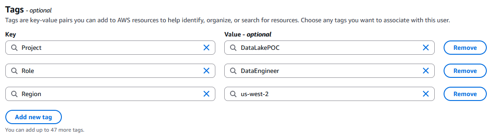

- **Paso 8.** Haz clic en **"Create user"**.

- **Paso 9.** Anota los datos en un **Bloc de notas** o descarga el **archivo CSV**, ya que los usar√°s en la siguiente tarea:

  - **Console sign-in URL**: 
    - Por ejemplo: `https://123456789012.signin.aws.amazon.com/console`.
  - **User name**: `data_engineer_lab`.
  - **Console password**: Definida.

> **TAREA FINALIZADA**

### Resultado esperado:
Usuario creado y vinculado al grupo `DataEngineers`, heredando sus políticas.

---

### Tarea 4: Iniciar sesión en la consola con el nuevo usuario.

**Descripción:** Verifica que el nuevo usuario pueda iniciar sesión correctamente.

- **Paso 1.** Abre una nueva ventana en **modo incógnito**.

- **Paso 2.** Copia y pega la URL de **Console sign-in URL** que anotaste.

- **Paso 3.** Ingresa los datos del usuario creado y clic en **Sign in**:

  - Usuario: `data_engineer_lab`.
  - Contraseña: Definida.

  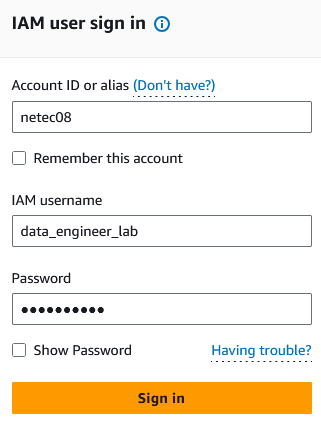

- **Paso 4.** Cambia la contraseña únicamente si el sistema lo solicita.

- **Paso 5.** Verifica en la parte superior derecha que la región seleccionada sea **us-west-2 (Oregón)**.

> **TAREA FINALIZADA**

### Resultado esperado:
El usuario puede iniciar sesión exitosamente en la consola web de AWS.

---

## Tarea 5: Validar acceso a servicios permitidos.

**Descripción:** Verifica el acceso a los servicios y la denegación en servicios no permitidos.

- **Paso 1.** Desde la consola, accede a:

  - **Amazon S3** ‚Üí Puedes acceder al bucket `lab-databucket-xxxxxxx`. Para ello, da clic sobre el nombre de la carpeta **data**; posteriormente, intenta eliminar el archivo **ventas.csv**.

  

  - **AWS Glue** ‚Üí Puedes usar crawlers, cat√°logos y jobs. Intenta crear una Base de datos dentro del cat√°logo.

  
    
  ---
    
  

  - **Amazon Redshift** → Puedes consultar clústeres (solo lectura). **Inmediatamente ingresando** a la consola principal de **Redshift**, marca error por la **política** del usuario.

    

- **Paso 2.** Intenta acceder a servicios, tales como **EC2**, **IAM** o **RDS**. Después, debe mostrar **“Access Denied”**.

  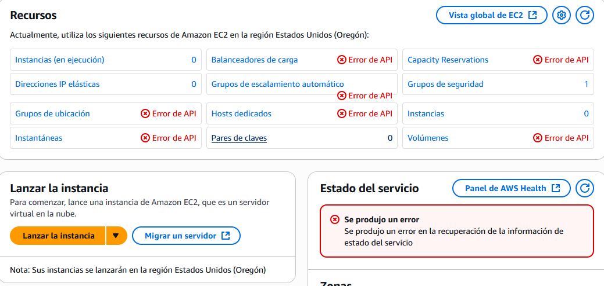
  
  ---
  
  
  
  ---
  
  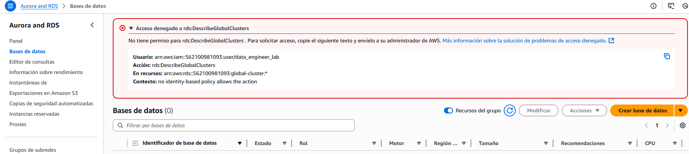

> **TAREA FINALIZADA**

### Resultado esperado:
Acceso restringido correctamente según las políticas del grupo IAM.

---

> **¬°FELICIDADES, HAS COMPLETADO EL LABORATORIO 1!**

## Resultado final:

Has creado exitosamente un grupo IAM llamado `DataEngineers`, con una política personalizada y permisos gestionados. El usuario `data_engineer_lab` puede iniciar sesión en la consola de AWS en la región us-west-2 y trabajar exclusivamente con los servicios S3 (de forma específica), Glue y Redshift.

Este usuario no tiene acceso a otros servicios, lo que garantiza el cumplimiento del principio de mínimo privilegio.

---

## URLS de referencia:

- [Documentación oficial de IAM](https://docs.aws.amazon.com/IAM/latest/UserGuide/introduction.html)
- [Guía para crear políticas IAM](https://docs.aws.amazon.com/IAM/latest/UserGuide/access_policies_create-console.html)
- [Permisos administrados de AWS Glue](https://docs.aws.amazon.com/glue/latest/dg/security-iam.html)
- [Acceso restringido a buckets S3](https://docs.aws.amazon.com/AmazonS3/latest/userguide/s3-access-control.html)
- [Iniciar sesión como usuario IAM](https://docs.aws.amazon.com/IAM/latest/UserGuide/console.html)

---

**[⬅️ Atrás](https://netec-mx.github.io/TPRACT_INGDAT_Priv/Capítulo8/lab14.html)** | **[Lista general](https://netec-mx.github.io/TPRACT_INGDAT_Priv/)** | **[Siguiente ➡️](https://netec-mx.github.io/TPRACT_INGDAT_Priv/Capítulo3/lab2.html)**
