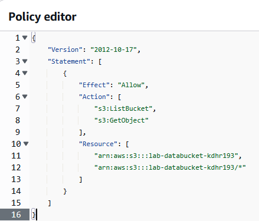

# Práctica 1: Creación de un usuario en IAM y asignación de políticas

## Objetivo

Crear un nuevo usuario IAM con acceso restringido a servicios utilizados por ingenieros de datos, incluyendo su integración a un grupo IAM con una política personalizada. Todo se realizará en la región **us-west-2 (Oregón)**.

## Requisitos

- Acceso a una cuenta de AWS con permisos administrativos (ej. rol `AdministratorAccess`).
- Navegador web moderno con conexión a internet.
- Familiaridad básica con la consola de AWS.

## Duración aproximada

- 20 minutos

## Región de AWS

- us-west-2 (Oregón)

---

**[⬅️ Atrás](https://netec-mx.github.io/TPRACT_INGDAT_Priv/Capítulo8/lab14.html)** | **[Lista General](https://netec-mx.github.io/TPRACT_INGDAT_Priv/)** | **[Siguiente ➡️](https://netec-mx.github.io/TPRACT_INGDAT_Priv/Capítulo3/lab2.html)**

---

## Instrucciones

## Tarea 1: Iniciar sesión en la consola AWS

**Descripción:** Acceder como usuario IAM.

### Tarea 1.1

- **Paso 1.** Ir a [AWS Console](https://aws.amazon.com/console)

- **Paso 2.** Clic en **Sign in**

- **Paso 3.** Iniciar sesión con:

  - Account ID or alias: `Cuenta asignada en el curso`
  - IAM username: `Asignado en el curso`
  - Password: `Asignada en el curso`

- **Paso 4.** Verificar que estás en la región `us-west-2`

    

> **TAREA FINALIZADA**

**Resultado esperado:** Acceso exitoso a la consola.

---

## Tarea 2: Crear grupo IAM con políticas personalizadas

**Descripción:** Se crea el grupo `DataEngineers` con una política personalizada que restringe el acceso a un bucket S3 específico y se agregan políticas administradas de Glue y Redshift.

### Tarea 2.1

- **Paso 1.** En la barra de búsqueda superior, escribe `IAM` y selecciona el servicio.

  

- **Paso 2.** En el menú izquierdo, haz clic en **"User groups"** → luego en **"Create group"**.

  
  
  ---

  

- **Paso 3.** Escribe como nombre del grupo: `DataEngineers`

  

- **Paso 4.** Haz clic en **"Create user group"** hasta el final de la página.

  

- **Paso 5.** Ahora da clic para entrar a las propiedades del grupo.

  

- **Paso 6.** En la pestaña **"Permissions"**, haz clic en **"Add permissions"** y luego en **"Create inline policy"**.

  

- **Paso 7.** Pega la siguiente política personalizada en un **bloc de notas para editarla**. **Sustituye** el nombre del bucket en el politica. Por el que se te asigno al curso.

  ```json
  {
    "Version": "2012-10-17",
    "Statement": [
      {
        "Effect": "Allow",
        "Action": ["s3:ListBucket", "s3:GetObject"],
        "Resource": [
          "arn:aws:s3:::lab-databucket-xxxxxxx",
          "arn:aws:s3:::lab-databucket-xxxxxxx/*"
        ]
      }
    ]
  }
  ```
  ---
  
  

- **Paso 8.** Ya editada la politica copiala y regresa a la consola de edición de la politica de IAM. Da clic en **JSON** y luego **borra** el **contenido** de la politica actual y **pega la nueva politica.**

  
  ---
  
  

- **Paso 9.** Haz clic en **"Next"**, y nombra la política: `S3Access-DataIngest-Bucket`

  

- **Paso 10.** Finalmente da clic en el botón **Create policy**.

- **Paso 11.** Ahora en la misma pestaña de **Permissions**. Clic en **Add permissions** y luego en **Attach policies**.

  

- **Paso 12.** Selecciona las políticas administradas:
  
  - `AWSGlueConsoleFullAccess`
  - `AmazonRedshiftReadOnlyAccess`

  
  
  ---
  
  

- **Paso 13.** Clic en el botón **Attach policies**.

> **TAREA FINALIZADA**

**Resultado esperado:** Grupo IAM `DataEngineers` creado con acceso solo al bucket `lab-databucket-xxxxxxx`, Glue completo y Redshift solo lectura.

---

## Tarea 3: Crear un nuevo usuario y asociarlo al grupo

**Descripción:** Crear el usuario `data_engineer_lab` y asociarlo al grupo `DataEngineers`.

### Tarea 3.1

- **Paso 1.** En el servicio **IAM**, ve a **"Users"** → **"Create user"**.

  

- **Paso 2.** En **User name**, escribe: `data_engineer_lab`

  

- **Paso 3.** Marca **"Provide user access to the AWS Management Console"**.

  

- **Paso 4.** Clic en **Custom password** y define una contraseña segura (ejemplo: `Datos2025!`).

  

- **Paso 5.** Desmarca **"Users must create a new password at next sign-in - Recommended"** y da clic en **Next**.

  

- **Paso 6.** En la sección de **Set permissions**, selecciona **"Add user to group"** y marca **`DataEngineers`**. Clic en **Next**

  

- **Paso 7.** En la sección **Review and create** añade las siguientes etiquetas:

  - `Key: Project` | `Value: DataLakePOC`  
  - `Key: Role`    | `Value: DataEngineer`  
  - `Key: Region`  | `Value: us-west-2`

  

- **Paso 8.** Haz clic en **"Create user"**.

- **Paso 9.** Anota los datos en un **bloc de notas** o descarga el **archivo CSV** los usaras en la siguiente tarea:

  - **Console sign-in URL**: 
    - Por ejemplo: `https://123456789012.signin.aws.amazon.com/console`
  - **User name**: `data_engineer_lab`
  - **Console Password**: (Definida)

> **TAREA FINALIZADA**

**Resultado esperado:** Usuario creado y vinculado al grupo `DataEngineers`, heredando sus políticas.

---

## Tarea 4: Iniciar sesión en la consola con el nuevo usuario

**Descripción:** Verificar que el nuevo usuario puede iniciar sesión correctamente.

### Tarea 4.1

- **Paso 1.** Abre una nueva ventana en **modo incógnito**.

- **Paso 2.** Copia y pega la URL de **Console sign-in URL** anotado.

- **Paso 3.** Ingresa los datos del usuario creado y clic en **Sign in**:

  - Usuario: `data_engineer_lab`
  - Contraseña: Definida

  

- **Paso 4.** Cambia la contraseña solo si se solicita.

- **Paso 5.** Verifica en la parte superior derecha que estás en la región **us-west-2 (Oregón)**.

> **TAREA FINALIZADA**

**Resultado esperado:** El usuario puede ingresar exitosamente a la consola web de AWS.

---

## Tarea 5: Validar acceso a servicios permitidos

**Descripción:** Verificar acceso a servicios y denegación en servicios no permitidos.

### Tarea 5.1

- **Paso 1.** Desde la consola, accede a:

  - **Amazon S3** → Puedes acceder al bucket `lab-databucket-xxxxxxx`. Da clic sobre el nombre de la carpeta **data** después Intenta eliminar el archivo **ventas.csv**

  

  - **AWS Glue** → Puedes usar crawlers, catálogos y jobs. Intenta crear una Base de datos dentro del catalogo.

  
    
  ---
    
  

  - **Amazon Redshift** → Puedes consultar clústeres (solo lectura). **Inmediatamente ingresando** a la consola principal de **Redshift** marca error por la **politica** del usuario

    

- **Paso 2.** Intenta acceder a servicios como **EC2**, **IAM** o **RDS**. Debe mostrar **“Access Denied”**.

  
  
  ---
  
  
  
  ---
  
  

> **TAREA FINALIZADA**

**Resultado esperado:** Acceso restringido correctamente según las políticas del grupo IAM.

---

> **¡FELICIDADES HAZ COMPLETADO EL LABORATORIO 1!**

## Resultado final

Se ha creado exitosamente un grupo IAM (`DataEngineers`) con una política personalizada y permisos gestionados. El usuario `data_engineer_lab` puede iniciar sesión en la consola de AWS en la región us-west-2 y trabajar únicamente con S3 (específico), Glue y Redshift. No tiene acceso a otros servicios, cumpliendo con el principio de mínimo privilegio.

---

## URLS de referencia

- [Documentación oficial de IAM](https://docs.aws.amazon.com/IAM/latest/UserGuide/introduction.html)
- [Guía para crear políticas IAM](https://docs.aws.amazon.com/IAM/latest/UserGuide/access_policies_create-console.html)
- [Permisos administrados de AWS Glue](https://docs.aws.amazon.com/glue/latest/dg/security-iam.html)
- [Acceso restringido a buckets S3](https://docs.aws.amazon.com/AmazonS3/latest/userguide/s3-access-control.html)
- [Iniciar sesión como usuario IAM](https://docs.aws.amazon.com/IAM/latest/UserGuide/console.html)

---

**[⬅️ Atrás](https://netec-mx.github.io/TPRACT_INGDAT_Priv/Capítulo8/lab14.html)** | **[Lista General](https://netec-mx.github.io/TPRACT_INGDAT_Priv/)** | **[Siguiente ➡️](https://netec-mx.github.io/TPRACT_INGDAT_Priv/Capítulo3/lab2.html)**