# Práctica 2: Configuración de Grupos de Seguridad en AWS

## Objetivo  

Aprender a crear y configurar grupos de seguridad (Security Groups) en AWS para controlar el tráfico de red en entornos de análisis y procesamiento de datos, siguiendo buenas prácticas de seguridad.

## Requisitos
 
- Acceso a la consola de AWS con permisos suficientes  
- Conocimientos básicos sobre redes, protocolos y puertos

## Duración aproximada 

- 40 minutos

## Región de AWS

- us-west-2 (Oregón)

---

**[⬅️ Atrás](https://netec-mx.github.io/TPRACT_INGDAT_Priv/Capítulo2/lab1.html)** | **[Lista General](https://netec-mx.github.io/TPRACT_INGDAT_Priv/)** | **[Siguiente ➡️](https://netec-mx.github.io/TPRACT_INGDAT_Priv/Capítulo3/lab3.html)**

---

## Instrucciones 

## Tarea 1: Iniciar sesión en la consola AWS

**Descripción:** Acceder como usuario IAM.

### Tarea 1.1

- **Paso 1.** Ir a [AWS Console](https://aws.amazon.com/console)

- **Paso 2.** Clic en **Sign in**

- **Paso 3.** Iniciar sesión con:

  - Account ID or alias: `Cuenta asignada en el curso`
  - IAM username: `Asignado en el curso`
  - Password: `Asignada en el curso`

- **Paso 4.** Verificar que estás en la región `us-west-2`

    

> **TAREA FINALIZADA**

**Resultado esperado:** Acceso exitoso a la consola.

---

## Tarea 2: Acceso a la sección de grupos de seguridad (Security Groups)

### Tarea 2.1

- **Paso 1.** Desde el buscador superior de la consola, escribir `EC2` y seleccionar el servicio

    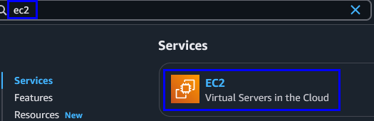

- **Paso 2.** Verifica que estás en la región **Oregon (`us-west-2`)**

- **Paso 3.** En el menú lateral izquierdo, buscar el apartado **Network & Security** y hacer clic en **Security Groups**

    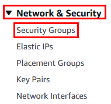

> **TAREA FINALIZADA**

**Resultado esperado:** Acceso a la lista de grupos de seguridad del VPC en la región de Oregon.

---

## Tarea 3: Creación de un grupo de seguridad personalizado  

### Tarea 3.1

- **Paso 1.** Hacer clic en el botón **Create security group**

    **NOTA:** Puede haber mas **SGs** por el momento los omitimos.

    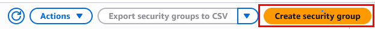

- **Paso 2.** Escribe el nombre: `SG-Analisis-Datos`.

    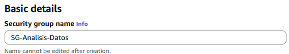

- **Paso 3.** Escribe la descripción: `Grupo para acceso controlado a herramientas de analisis de datos`  

    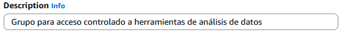

- **Paso 4.** Selecciona del menú la VPC llamada: `LabVPC`

    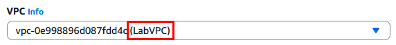

- **Paso 5.** Da clic en la opción **Create security Group**

> **TAREA FINALIZADA**

**Resultado esperado:** Grupo de seguridad creado con información básica en la región correcta.

---

## Tarea 4: Configuración de reglas de entrada (Inbound Rules)

### Tarea 4.1

- **Paso 1.** Dentro de la creación del grupo, ir a la sección **Inbound rules** y dar clic en **Edit inbound rules**

    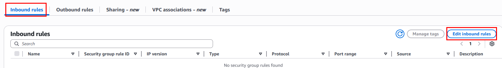

- **Paso 2.** Agregar una nueva regla para **SSH**:

    - Type: `SSH`  
    - Protocol: `TCP`  
    - Port: `22`  
    - Source: `Anywhere-IPv4` 
    
    ---
    
    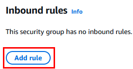
    
    ---
    
    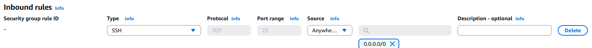

- **Paso 3.** Agregar regla para servicio de análisis (por ejemplo, Jupyter):

  - Type: `Custom TCP` 
  - Port: `8888`  
  - Source: `Anywhere-IPv4`
  
  ---
  
  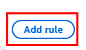
  
  ---
  
  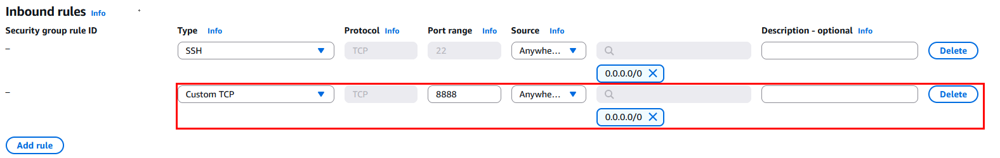

- **Paso 4.** Agregar regla para el protocolo HTTP:

  - Type: `HTTP` 
  - Port: `80`  
  - Source: `Anywhere-IPv4`
  
  ---
  
  
  
  ---
  
  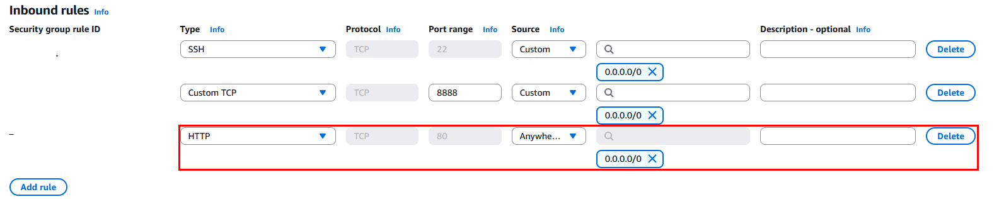

- **Paso 5.** Agregar regla para el protocolo HTTPS:

  - Type: `HTTPS` 
  - Port: `443`  
  - Source: `Anywhere-IPv4`
  
  ---
  
  
  
  ---
  
  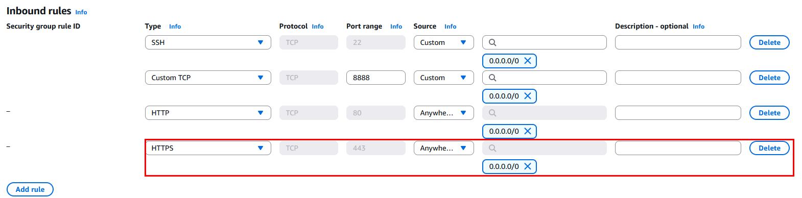

- **Paso 6.** Clic en el boton **Save rules** para guardar las reglas de entrada.  

> **TAREA FINALIZADA**

**Resultado esperado:** Reglas de entrada configuradas correctamente en el grupo creado en Oregon.

---

## Tarea 5: Configuración de reglas de salida (Outbound Rules)

### Tarea 5.1  

- **Paso 1.** Revisa la sección **Outbound rules**

    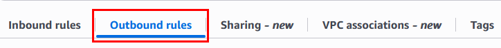

- **Paso 2.** Verifica que exista una regla ya creada por defecto con:

    - Type: `All traffic`  
    - Destination: `0.0.0.0/0`
    
    ---
    
    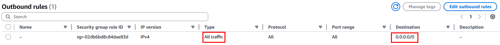

> **TAREA FINALIZADA**

**Resultado esperado:** Reglas de salida correctamente configuradas para permitir conectividad.

---

## Tarea 6: Etiquetado del grupo de seguridad

### Tarea 6.1 

- **Paso 1.** Clic en la sección de **Tags** y luego en **Manage tags**. Agregar una etiqueta con:

  - Key: `Name`  
  - Value: `Grupo-Seguridad-Datos` 
    
  ---
    
  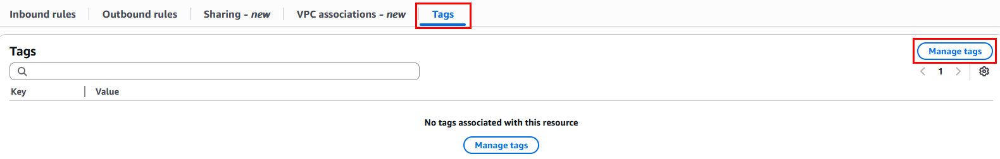
   
  ---
    
  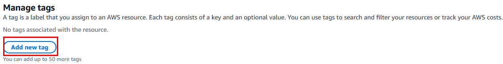
    
  ---
    
  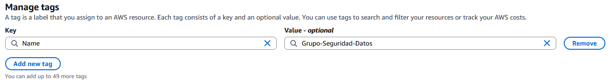

- **Paso 2.** Agregar etiquetas adicionales:

  - Key: `Proyecto`, Value: `DataPipeline`  
  - Key: `Ambiente`, Value: `Desarrollo`  
  - Key: `Equipo`, Value: `IngenieriaDatos`
    
  ---
    
  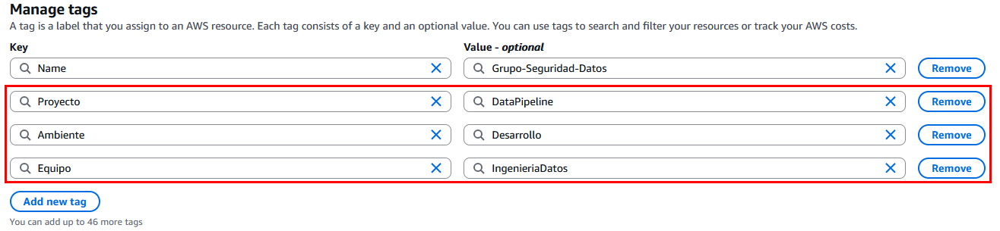

- **Paso 3.** Finalmente clic en **Save changes**.

> **TAREA FINALIZADA**

**Resultado esperado:** Grupo de seguridad etiquetado para fácil identificación y trazabilidad de costos.

---

## Tarea 7: Validación final del grupo de seguridad

### Tarea 7.1 

- **Paso 1.** Ir a la lista de grupos de seguridad en **Oregon (`us-west-2`)** 

- **Paso 2.** Buscar `SG-Analisis-Datos` y revisar configuración 

- **Paso 3.** Verificar que las reglas coincidan con lo definido 

- **Paso 4.** Copia el `Security group ID` a un **bloc de notas** lo usaras más adelante. 

> **TAREA FINALIZADA**

**Resultado esperado:** Grupo de seguridad correctamente configurado y verificado en la región de Oregon.

---

> **¡FELICIDADES HAZ COMPLETADO EL LABORATORIO 2!**

## Resultado final

El usuario habrá creado un grupo de seguridad específico para análisis de datos en la región de Oregon, con reglas controladas, etiquetas bien definidas y verificación de la configuración, siguiendo buenas prácticas de seguridad en AWS.

---

## Notas y/o Consideraciones

- Utiliza `My IP` para evitar exponer servicios a todo internet  
- Usa etiquetas para ayudar en auditorías, trazabilidad y control de costos  
- La configuración de puertos debe ajustarse a las herramientas utilizadas por tu equipo de datos  
- Este grupo puede utilizarse posteriormente para asociarlo a instancias EC2, EMR o servicios de contenedores  
- Se recomienda revisar periódicamente las reglas de seguridad y mantenerlas al mínimo necesario

## URLS de referencia
  
- [AWS Security Groups](https://docs.aws.amazon.com/vpc/latest/userguide/VPC_SecurityGroups.html)  
- [Best Practices for Security Groups](https://docs.aws.amazon.com/AWSEC2/latest/UserGuide/security-group-rules.html)

---

**[⬅️ Atrás](https://netec-mx.github.io/TPRACT_INGDAT_Priv/Capítulo2/lab1.html)** | **[Lista General](https://netec-mx.github.io/TPRACT_INGDAT_Priv/)** | **[Siguiente ➡️](https://netec-mx.github.io/TPRACT_INGDAT_Priv/Capítulo3/lab3.html)**