# Práctica 3: Lanzamiento de una instancia EC2

## Objetivo 

Lanzar una instancia EC2 en AWS para entornos de análisis de datos, utilizando Amazon Linux 2023, asociando un IAM Role (Instance Profile), configurando almacenamiento, grupo de seguridad, y ejecutando un script de instalación automática de JupyterLab mediante `User Data`.

## Requisitos

- Haber completado la Práctica 2: Configuración de grupos de seguridad  
- Tener acceso a la consola de AWS (IAM user)    
- Conocimiento básico de EC2, SSH, y configuración de red

## Duración aproximada

- 60 minutos

## Región de AWS

- us-west-2 (Oregón)

---

**[⬅️ Atrás](https://netec-mx.github.io/TPRACT_INGDAT_Priv/Capítulo3/lab2.html)** | **[Lista General](https://netec-mx.github.io/TPRACT_INGDAT_Priv/)** | **[Siguiente ➡️](https://netec-mx.github.io/TPRACT_INGDAT_Priv/Capítulo3/lab4.html)**

---

## Instrucciones

## Tarea 1: Iniciar sesión en la consola AWS

**Descripción:** Acceder como usuario IAM.

### Tarea 1.1

- **Paso 1.** Ir a [AWS Console](https://aws.amazon.com/console)

- **Paso 2.** Clic en **Sign in**

- **Paso 3.** Iniciar sesión con:

  - Account ID or alias: `Cuenta asignada en el curso`
  - IAM username: `Asignado en el curso`
  - Password: `Asignada en el curso`

- **Paso 4.** Verificar que estás en la región `us-west-2`

    

> **TAREA FINALIZADA**

**Resultado esperado:** Acceso exitoso a la consola.

---

## Tarea 2: Iniciar el asistente de creación de instancias

### Tarea 2.1

- **Paso 1.** Ir al servicio **EC2**

  

- **Paso 2.** En el panel izquierdo, hacer clic en **Instances** 

  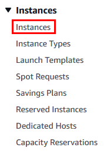

- **Paso 3.** Hacer clic en el botón **Launch instances**

  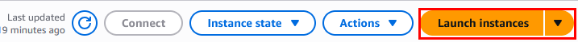

> **TAREA FINALIZADA**

**Resultado esperado:** Acceso al asistente para lanzar una nueva instancia EC2.

---

## Tarea 3: Configurar sistema operativo, tipo y nombre

### Tarea 3.1

- **Paso 1.** Nombre: `Instancia-Jupyter-Datos` 

  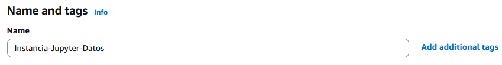

- **Paso 2.** AMI: **Amazon Linux 2023** (64-bit x86)

  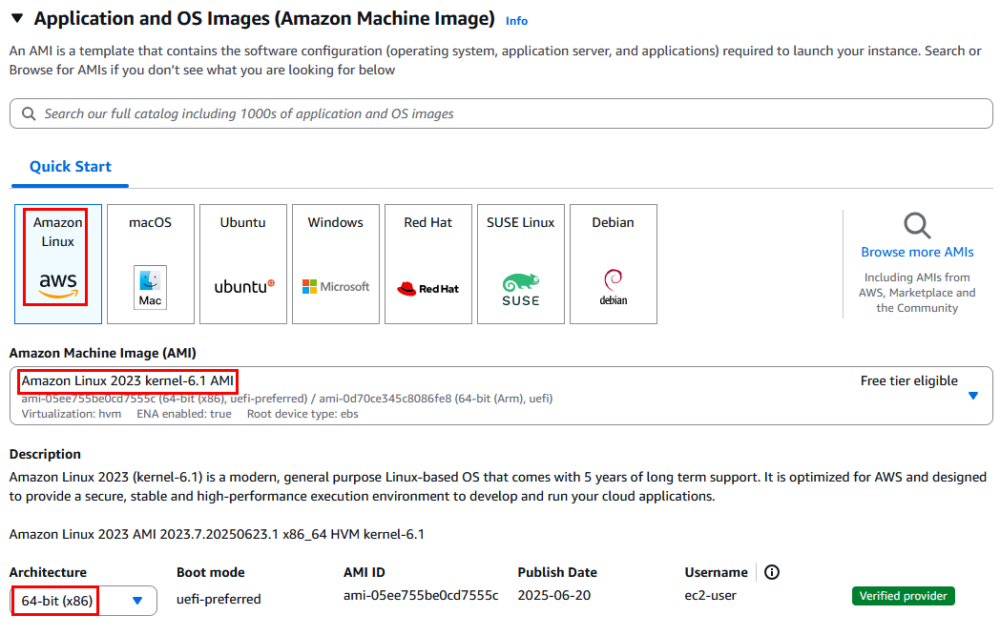

- **Paso 3.** Tipo de instancia recomendado: `t3.small` (2 vCPU, 2 GB RAM, burstable y rentable)

  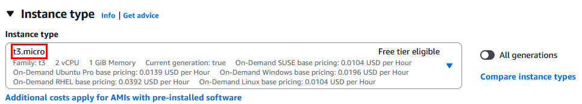

> **TAREA FINALIZADA**

**Validación:** AMI oficial, arquitectura correcta, instancia balanceada y económica.

---

## Tarea 4: Seleccionar o crear clave SSH

### Tarea 4.1

- **Paso 1.** En **Key pair (login)**:

  - Crear una nueva clave llamada: `llave-jupyter`  
  
  ---
  
  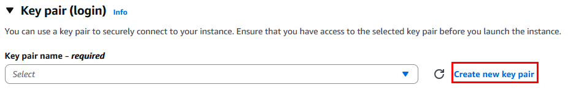
  
  ---
  
  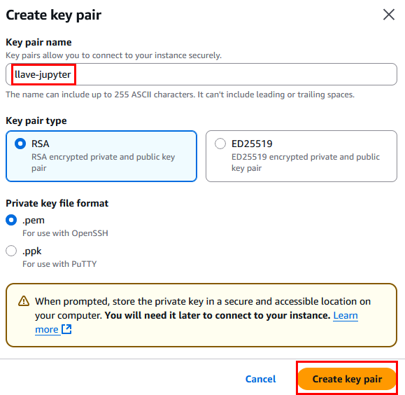

- **Paso 2.** La llave se descarga automaticamente en tu equipo, guardarla muy bien por si se requiere usar.

> **TAREA FINALIZADA**

**Resultado esperado:** Clave configurada correctamente.

---

## Tarea 5: Configurar red y grupo de seguridad

### Tarea 5.1

- **Paso 1.** En **Network settings** clic en el boton **Edit**:

  - VPC: `LabVPC`  
  - Subnet: `Public Subnet 1`  
  - Auto-assign public IP: `Enable`
  
  ---
  
  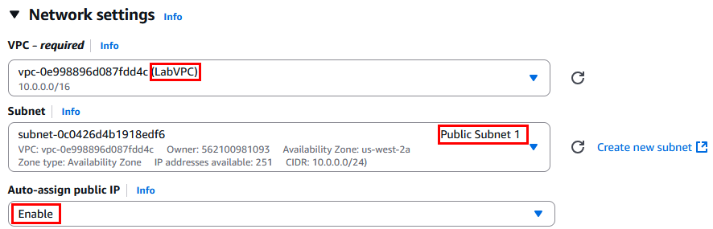

- **Paso 2.** Firewall (security groups):

  - Select existing security group: `SG-Analisis-Datos`  
  - Confirmar que permite:
        
      **NOTA** Los puertos estan permitos ya que es el grupo de seguriad configurado en el Laboratorio2.
        
      - Puerto 22 (SSH) desde tu IP  
      - Puerto 8888 (JupyterLab) desde tu IP
  
      ---
   
     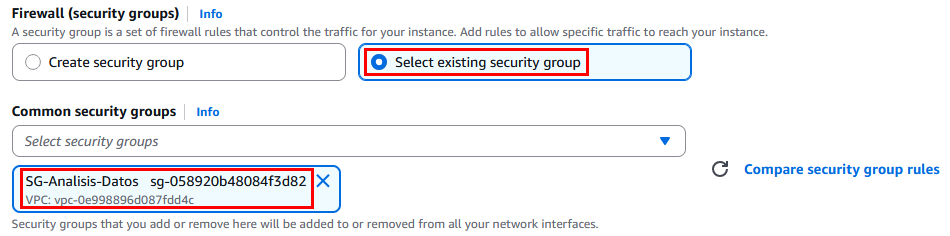

> **TAREA FINALIZADA**

**Resultado esperado:** Reglas adecuadas para conectividad segura desde tu equipo.

---

## Tarea 6: Configurar almacenamiento

### Tarea 6.1 

- **Paso 1.** En **Configure storage**
    
  - Tamaño recomendado: **25 GiB**  
  - Tipo de volumen: `gp3`
  
  --- 
  
  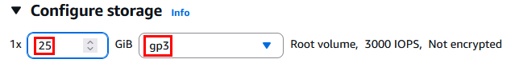

> **TAREA FINALIZADA**

**Validación:** Espacio suficiente para almacenar notebooks, datasets y logs.

---

## Tarea 7: Asignar un Instance Profile (IAM Role)

### Tarea 7.1 

- **Paso 1** En **Advanced details**, buscar el campo **IAM instance profile** 

- **Paso 2.** Seleccionar el role previamente creado, por ejemplo: `EC2Role`

  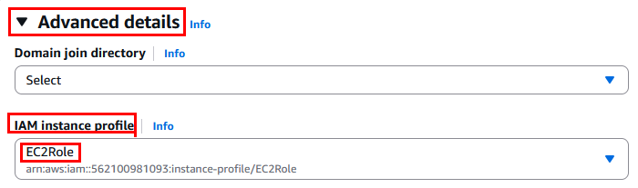

- **Paso 3.** El role contiene la politica de:
    
  - `AmazonS3ReadOnlyAccess`

> **TAREA FINALIZADA** 

**Resultado esperado:** Instancia con permisos administrados para acceder a servicios AWS como S3.

---

## Tarea 8: Configurar el script de User Data

### Tarea 8.1 

- **Paso 1.** En el mismo apartado de **Advanced details**, pero casi al final, pega el siguiente script en **User data**:

  ```bash
  #!/bin/bash
  # Actualizar sistema
  sudo yum update -y
  # Instalar Python y pip
  sudo yum install -y python3 python3-pip
  # Instalar pip actualizado
  curl -O https://bootstrap.pypa.io/get-pip.py
  python3 get-pip.py
  # Instalar JupyterLab para ec2-user
  sudo runuser -l ec2-user -c "pip3 install --user jupyterlab"
  # Asegurar que .local/bin esté en PATH en bashrc
  echo 'export PATH=$HOME/.local/bin:$PATH' >> /home/ec2-user/.bashrc
  # Crear directorio de notebooks y asignar permisos
  mkdir -p /home/ec2-user/notebooks
  chown ec2-user:ec2-user /home/ec2-user/notebooks
  sudo tee /etc/systemd/system/jupyter.service > /dev/null <<EOF
  [Unit]
  Description=JupyterLab
  After=network.target

  [Service]
  Type=simple
  User=ec2-user
  WorkingDirectory=/home/ec2-user/notebooks
  ExecStart=/bin/bash -c 'source /home/ec2-user/.bashrc && /home/ec2-user/.local/bin/jupyter lab --ip=0.0.0.0 --port=8888 --no-browser --NotebookApp.token=""'
  Restart=always

  [Install]
  WantedBy=multi-user.target
  EOF

  sudo systemctl daemon-reload
  sudo systemctl enable jupyter
  sudo systemctl start jupyter
  ```
  
  ---
  
  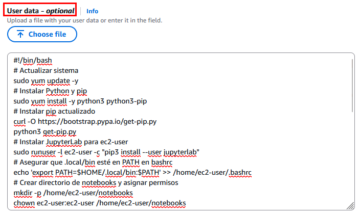

> **TAREA FINALIZADA** 

**Validación:** Este script instalará JupyterLab y lo levantará automáticamente en el puerto 8888 sin token.

---

## Tarea 9: Revisión y lanzamiento

### Tarea 9.1

- **Paso 1.** Revisar todas las configuraciones: 

  - AMI  
  - Tipo `t3.small`  
  - Clave privada  
  - Grupo de seguridad  
  - IAM Role  
  - Script de User Data 

- **Paso 2.** Hacer clic en **Launch instance**

  

- **Paso 3.** Clic en el boton inferior derecha **View all instances** 

- **Paso 4.** Mientras esperas a que el estado sea `running` avanza con la **Tarea 10.**

> **TAREA FINALIZADA** 

**Resultado esperado:** Instancia lanzada correctamente, con JupyterLab corriendo en segundo plano.

---

## Tarea 10: Añadir etiquetas

### Tarea 10.1

- **Paso 1.** Da clic en la sección **Tags**.

  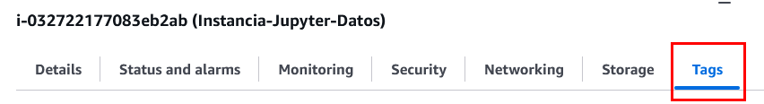

- **Paso 2.** Agregar las siguientes etiquetas que falten, clic en **Manage tags** luego en **Add new tag**:

  | Key       | Value             |
  |-----------|-------------------|
  | Name      | Instancia-Jupyter-Datos |
  | Proyecto  | DataPipeline      |
  | Ambiente  | Desarrollo        |
  | Equipo    | IngenieriaDatos   |
  
  ---
  
  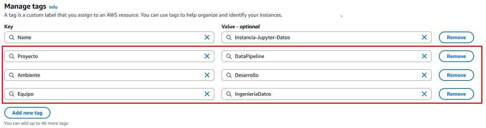

- **Paso 3.** Clic en el botón **Save**.

> **TAREA FINALIZADA** 

**Resultado esperado:** Recursos etiquetados correctamente para administración y monitoreo.

---

## Tarea 11: Verificar acceso a JupyterLab

### Tarea 11.1

- **Paso 1.** Obtener la IP pública de la instancia, selecciona la instancia para obtener los detalles, copia la IP publica.

  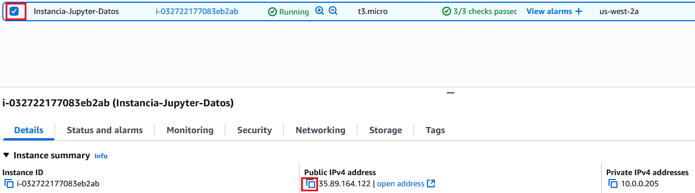

- **Paso 2.** En tu navegador, abre una pestaña nueva y pega tu IP Publica con el puerto 8888:

    **NOTA:** Asegurate que sea mediante el puerto 80 (HTTP)

  ```
  http://<IP_PUBLICA>:8888
  ```
  ---
  


- **Paso 3.** Verifica que JupyterLab cargue sin solicitar token

  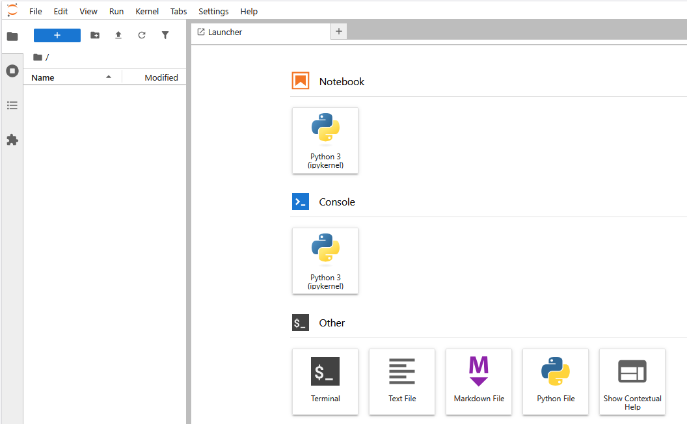

- **Paso 4.** Crear un nuevo notebook clic en **`File`**/**`New`**/**`Notebook`**

- **Paso 5.** Cargara una ventana emergente asegurate de seleccionar **Python 3 (ipykernel)** y clic en **Select**

  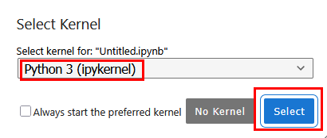

- **Paso 6.** En la primera celda escribe el siguiente codigo y ejecuta la celda:

  ```bash
  pip install boto3
  pip install pandas
  ```
  
  ---
  
  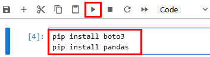
  
  ---
  
  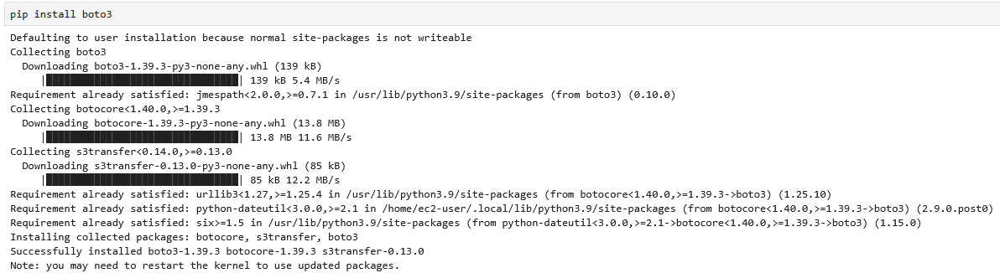
  
  ---

  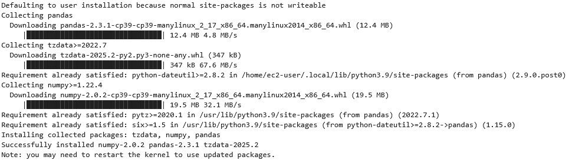

- **Paso 7.** Ahora reinicia el kernel y da clic en el botón **Restart**

      
  
  ---
  
  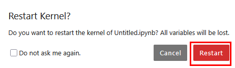   

- **Paso 8.** En la siguiente celda agrega el siguiente codigo, cambia el nombre de tu bucket de s3 asignado al curso. **Ejecuta la celda**

  ```python
  import boto3

  # Configura tu bucket y archivo
  bucket_name = 'AGREGAR-TU-BUCKET-AQUI'
  object_key = 'data/ventas.csv'
  local_file = 'ventas.csv'

  # Crear cliente de S3 (usa credenciales de entorno o perfil por defecto)
  s3 = boto3.client('s3')

  # Descargar archivo
  try:
      s3.download_file(bucket_name, object_key, local_file)
      print(f'Archivo descargado como: {local_file}')
  except Exception as e:
      print(f'Error al descargar archivo: {e}')
  ```
  
  ---
  
  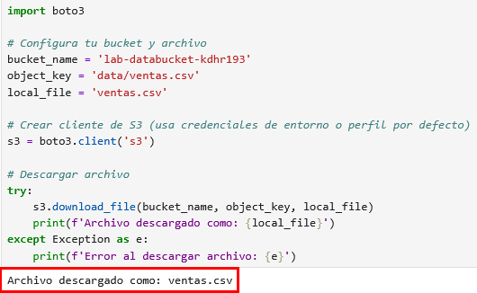  

- **Paso 9.** Ejemplo básico en Python para explorar el archivo de **ventas.csv**

  ```python
  import pandas as pd

  # Cargar archivo CSV local (ya descargado)
  df = pd.read_csv("ventas.csv", delimiter=',')

  # Ejemplo: Total de unidades vendidas por provincia
  print("\nUnidades vendidas por provincia:")
  print(df.groupby('Provincia')['Unidades'].sum())
  ```
  
  ---
  
  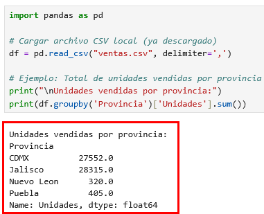

> **TAREA FINALIZADA** 

**Resultado esperado:** Acceso web exitoso a JupyterLab sin errores y con pruebas sobre el manejo de datos con python y pandas.

---

> **¡FELICIDADES HAZ COMPLETADO EL LABORATORIO 3!**

## Resultado final  

El usuario tendrá una instancia EC2 funcional en Amazon Linux, con JupyterLab preinstalado, accesible vía navegador, y configurada bajo buenas prácticas de red, almacenamiento, IAM y automatización.

---

## Notas y/o Consideraciones
  
- Si no ves JupyterLab, asegúrate de que el puerto 8888 esté abierto en tu grupo de seguridad  
- El uso de `--NotebookApp.token=''` deja la interfaz sin autenticación; úsalo solo para pruebas  
- Considera integrar certificados SSL o contraseñas si accedes desde redes públicas  
- Revisa CloudWatch Logs para verificar errores en el servicio `jupyter`

## URLS de referencia

- [Amazon EC2 User Data](https://docs.aws.amazon.com/AWSEC2/latest/UserGuide/user-data.html)  
- [JupyterLab CLI Options](https://jupyterlab.readthedocs.io/en/stable/user/urls.html)  
- [IAM Roles for EC2](https://docs.aws.amazon.com/IAM/latest/UserGuide/id_roles_use_switch-role-ec2.html)

---

**[⬅️ Atrás](https://netec-mx.github.io/TPRACT_INGDAT_Priv/Capítulo3/lab2.html)** | **[Lista General](https://netec-mx.github.io/TPRACT_INGDAT_Priv/)** | **[Siguiente ➡️](https://netec-mx.github.io/TPRACT_INGDAT_Priv/Capítulo3/lab4.html)**