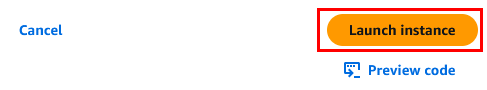

# Práctica 3. Lanzamiento de una instancia EC2

## 🎯 Objetivos:
Al finalizar la práctica, serás capaz de:
- Lanzar una instancia EC2 en AWS para entornos de análisis de datos, utilizando Amazon Linux 2023.
- Asociar un rol de IAM (Instance Profile) a la instancia.
- Configurar el almacenamiento y el grupo de seguridad.
- Ejecutar un script de instalación automática de JupyterLab mediante `User Data`.

## 📝 Requisitos previos:
- Haber completado la Práctica 2: Configuración de grupos de seguridad.
- Tener acceso a la consola de AWS con un usuario de IAM.
- Contar con conocimientos básicos sobre EC2, conexión por SSH y configuración de red.

## 🕒 Duración aproximada:
- 60 minutos.

## 📍 Región de AWS:
- us-west-2 (Oregón).

---

**[⬅️ Atrás](https://netec-mx.github.io/TPRACT_INGDAT_Priv/Capítulo3/lab2.html)** | **[Lista general](https://netec-mx.github.io/TPRACT_INGDAT_Priv/)** | **[Siguiente ➡️](https://netec-mx.github.io/TPRACT_INGDAT_Priv/Capítulo3/lab4.html)**

---

## Instrucciones:

## Tarea 1: Iniciar sesión en la consola AWS

### Tarea 1: Iniciar sesión en la consola de AWS.

**Descripción:** Accede como usuario IAM.

- **Paso 1.** Dirígete a [AWS Console](https://aws.amazon.com/console).

- **Paso 2.** Haz clic en **Sign in**.

- **Paso 3.** Inicia sesión con:

  - **Account ID or alias:** `Cuenta asignada en el curso`
  - **IAM username:** `Asignado en el curso`
  - **Password:** `Asignada en el curso`

- **Paso 4.** Verifica que estás en la región `us-west-2`.

    

> **TAREA FINALIZADA**

### Resultado esperado:
Obtendrás el acceso exitoso a la consola.

---

## Tarea 2: Iniciar el asistente de creación de instancias.

- **Paso 1.** Dirígete al servicio **EC2**.

  

- **Paso 2.** En el panel lateral izquierdo, haz clic en **Instances**.

  

- **Paso 3.** Haz clic en el botón **Launch instances**.

  

> **TAREA FINALIZADA**

### Resultado esperado:
Accederás al asistente para lanzar una nueva instancia EC2.

---

## Tarea 3: Configurar sistema operativo, tipo y nombre.

- **Paso 1.** Asigna el nombre: `Instancia-Jupyter-Datos`.

  

- **Paso 2.** AMI: **Amazon Linux 2023** (64-bit x86).

  

- **Paso 3.** Elige el tipo de instancia recomendado: `t3.small` (2 vCPU, 2 GB RAM, burstable y rentable).

  

> **TAREA FINALIZADA**

### Validación:
AMI oficial, arquitectura correcta, instancia balanceada y económica.

---

## Tarea 4: Seleccionar o crear clave SSH.

- **Paso 1.** En la sección **Key pair (login)**:

  - Crea una nueva clave bajo el nombre: `llave-jupyter`.  
  
  ---
  
  
  
  ---
  
  

- **Paso 2.** La clave se descargará automáticamente en tu equipo. Guárdala en un lugar seguro por si se requiere usar.

> **TAREA FINALIZADA**

### Resultado esperado:
Clave SSH creada y configurada correctamente.

---

## Tarea 5: Configurar red y grupo de seguridad

- **Paso 1.** En **Network settings**, haz clic en el botón **Edit**:

  - VPC: `LabVPC`  
  - Subnet: `Public Subnet 1`  
  - Auto-assign public IP: `Enable`
  
  ---
  
  

- **Paso 2.** Firewall (security groups):

  - Selecciona el grupo de seguridad existente: `SG-Analisis-Datos`.
  - Verifica que se permiten los siguientes puertos:
                
      - Puerto 22 (SSH) desde tu IP.
      - Puerto 8888 (JupyterLab) desde tu IP.

> 💡 ***Nota:** Estos puertos ya están habilitados, ya que el grupo de seguridad fue configurado previamente en el Laboratorio 2.*

      ---
   
     

> **TAREA FINALIZADA**

### Resultado esperado:
Reglas adecuadas para conectividad segura desde tu equipo.

---

## Tarea 6: Configurar almacenamiento.

- **Paso 1.** En la sección **Configure storage**:
    
  - Tamaño recomendado: **25 GiB**.
  - Tipo de volumen: `gp3`.
  
  --- 
  
  

> **TAREA FINALIZADA**

### Validación:
El espacio asignado es suficiente para almacenar notebook, datasets y logs.

---

## Tarea 7: Asignar un Instance Profile (IAM Role)

- **Paso 1** En la sección **Advanced details**, busca el campo **IAM instance profile**.

- **Paso 2.** Selecciona el rol previamente creado, por ejemplo: `EC2Role`

  

- **Paso 3.** Verifica que el rol incluya la política:
    
  - `AmazonS3ReadOnlyAccess`

> **TAREA FINALIZADA** 

### Resultado esperado:
La instancia contará con permisos administrados para acceder a servicios de AWS, como Amazon S3.

---

## Tarea 8: Configurar el script de User Data

- **Paso 1.** En el mismo apartado de **Advanced details**, desplázate hacia el final y pega el siguiente script en **User data**:

  ```bash
  #!/bin/bash
  # Actualizar sistema
  sudo yum update -y
  # Instalar Python y pip
  sudo yum install -y python3 python3-pip
  # Instalar pip actualizado
  curl -O https://bootstrap.pypa.io/get-pip.py
  python3 get-pip.py
  # Instalar JupyterLab para ec2-user
  sudo runuser -l ec2-user -c "pip3 install --user jupyterlab"
  # Asegurar que .local/bin esté en PATH en bashrc
  echo 'export PATH=$HOME/.local/bin:$PATH' >> /home/ec2-user/.bashrc
  # Crear directorio de notebooks y asignar permisos
  mkdir -p /home/ec2-user/notebooks
  chown ec2-user:ec2-user /home/ec2-user/notebooks
  sudo tee /etc/systemd/system/jupyter.service > /dev/null <<EOF
  [Unit]
  Description=JupyterLab
  After=network.target

  [Service]
  Type=simple
  User=ec2-user
  WorkingDirectory=/home/ec2-user/notebooks
  ExecStart=/bin/bash -c 'source /home/ec2-user/.bashrc && /home/ec2-user/.local/bin/jupyter lab --ip=0.0.0.0 --port=8888 --no-browser --NotebookApp.token=""'
  Restart=always

  [Install]
  WantedBy=multi-user.target
  EOF

  sudo systemctl daemon-reload
  sudo systemctl enable jupyter
  sudo systemctl start jupyter
  ```
  
  ---
  
  

> **TAREA FINALIZADA** 

### Validación:
Este script instalará JupyterLab y lo iniciará automáticamente en el puerto 8888, sin requerir token de acceso. 

---

## Tarea 9: Revisión y lanzamiento.

- **Paso 1.** Revisa todas las configuraciones: 

  - AMI  
  - Tipo `t3.small`  
  - Clave privada  
  - Grupo de seguridad  
  - IAM Role  
  - Script de User Data 

- **Paso 2.** Haz clic en **Launch instance**

  

- **Paso 3.** En la parte inferior derecha, haz clic en **View all instances** 

- **Paso 4.** - Mientras esperas a que el estado cambie a `running`, puedes avanzar con la **Tarea 10.**

> **TAREA FINALIZADA** 

### Resultado esperado:
La instancia se habrá lanzado correctamente, con JupyterLab ejecutándose en segundo plano.

---

## Tarea 10: Añadir etiquetas.

- **Paso 1.** Haz clic en la sección **Tags**.

  

- **Paso 2.** Agrega las siguientes etiquetas faltantes. Haz clic en **Manage tags** y luego en **Add new tag**:

  | Clave (Key)       | Value (Valor)             |
  |-----------|-------------------|
  | Name      | Instancia-Jupyter-Datos |
  | Proyecto  | DataPipeline      |
  | Ambiente  | Desarrollo        |
  | Equipo    | IngenieriaDatos   |
  
  ---
  
  

- **Paso 3.** Haz clic en el botón **Save**.

> **TAREA FINALIZADA** 

### Resultado esperado:
Los recursos estarán correctamente etiquetados, lo que facilitará su administración y monitoreo.

---

## Tarea 11: Verificar acceso a JupyterLab.

- **Paso 1.** Obtén la IP pública de tu instancia. Selecciona la instancia para obtener los detalles y copia la IP publica.

  

- **Paso 2.** En tu navegador, abre una pestaña nueva y pega tu IP Publica con el puerto 8888:

> 💡 ***Nota:** Asegúrate que sea mediante el puerto 80 (HTTP).*

  ```
  http://<IP_PUBLICA>:8888
  ```


- **Paso 3.** Verifica que JupyterLab cargue correctamente sin solicitar token de acceso.

  

- **Paso 4.** Crea un nuevo notebook: haz clic en **`File`** → **`New`** → **`Notebook`**.

- **Paso 5.** Se abrirá una ventana emergente. Asegúrate de seleccionar **Python 3 (ipykernel)** y haz clic en **Select**.

  

- **Paso 6.** En la primera celda, escribe el siguiente código y ejecuta la celda:

  ```bash
  !pip install boto3
  !pip install pandas
  ```
  
  ---
  
  
  
  ---
  
  
  
  ---

  

- **Paso 7.** Después, reinicia el kernel y haz clic en el botón **Restart**.

      
  
  ---
  
     

- **Paso 8.** En la siguiente celda, agrega el siguiente código. Cambia el nombre de tu bucket de s3 asignado al curso. Luego, **ejecuta la celda**.

  ```python
  import boto3

  # Configura tu bucket y archivo
  bucket_name = 'AGREGAR-TU-BUCKET-AQUI'
  object_key = 'data/ventas.csv'
  local_file = 'ventas.csv'

  # Crear cliente de S3 (usa credenciales de entorno o perfil por defecto)
  s3 = boto3.client('s3')

  # Descargar archivo
  try:
      s3.download_file(bucket_name, object_key, local_file)
      print(f'Archivo descargado como: {local_file}')
  except Exception as e:
      print(f'Error al descargar archivo: {e}')
  ```
  
  ---
  
    

- **Paso 9.** En la siguiente celda, agrega el siguiente código para explorar el archivo **ventas.csv**.

  ```python
  import pandas as pd

  # Cargar archivo CSV local (ya descargado)
  df = pd.read_csv("ventas.csv", delimiter=',')

  # Ejemplo: Total de unidades vendidas por provincia
  print("\nUnidades vendidas por provincia:")
  print(df.groupby('Provincia')['Unidades'].sum())
  ```
  


> **TAREA FINALIZADA** 

### Resultado esperado:
Obtendrás acceso web exitoso a JupyterLab, sin errores y con pruebas sobre el manejo de datos con Python y pandas.

---

> **¡FELICIDADES HAZ COMPLETADO EL LABORATORIO 3!**

## Resultado final:  

El usuario contará con una instancia EC2 funcional basada en Amazon Linux, con:
- JupyterLab preinstalado y accesible vía navegador web.
- Configuración bajo buenas prácticas de red, almacenamiento, IAM y automatización.

---

## Notas y/o consideraciones:
  
- Si no ves JupyterLab en el navegador, verifica que el puerto 8888 esté abierto en el grupo de seguridad de la instancia.
- El uso de `--NotebookApp.token=''` desactiva la autenticación; solo recomendado para entornos de prueba.  
- Considera integrar certificados SSL o establecer contraseñas si accedes desde redes públicas.
- Revisa los CloudWatch Logs para diagnosticar errores en el servicio `jupyter`.

## 🔗 URLS de referencia:

- [Amazon EC2 User Data](https://docs.aws.amazon.com/AWSEC2/latest/UserGuide/user-data.html)  
- [JupyterLab CLI Options](https://jupyterlab.readthedocs.io/en/stable/user/urls.html)  
- [IAM Roles for EC2](https://docs.aws.amazon.com/IAM/latest/UserGuide/id_roles_use_switch-role-ec2.html)

---

**[⬅️ Atrás](https://netec-mx.github.io/TPRACT_INGDAT_Priv/Capítulo3/lab2.html)** | **[Lista general](https://netec-mx.github.io/TPRACT_INGDAT_Priv/)** | **[Siguiente ➡️](https://netec-mx.github.io/TPRACT_INGDAT_Priv/Capítulo3/lab4.html)**
