# Práctica 4: Creación de una función Lambda desde cero.

## Objetivo

- Crear desde cero dos funciones Lambda en la región **us-west-2 (Oregón)**:
- Una función que procese archivos de un bucket S3 (`s3_data_processor`)
- Otra que reciba datos desde API Gateway (`api_data_receiver`)
- Con enfoque en ingeniería de datos, seguridad y buenas prácticas de configuración.

## Requisitos

- Acceso a la consola de AWS como usuario IAM con permisos para Lambda, IAM y CloudWatch.
- Bucket de S3 previamente creado: `lab-databucket-xxxxx`.

## Duración aproximada

- 120 minutos

## Región de AWS

- us-west-2 (Oregón)

---

**[⬅️ Atrás](https://netec-mx.github.io/TPRACT_INGDAT_Priv/Capítulo3/lab3.html)** | **[Lista General](https://netec-mx.github.io/TPRACT_INGDAT_Priv/)** | **[Siguiente ➡️](https://netec-mx.github.io/TPRACT_INGDAT_Priv/Capítulo3/lab5.html)**

---

## Instrucciones

## Tarea 1: Iniciar sesión en la consola AWS

**Descripción:** Acceder como usuario IAM.

### Tarea 1.1

- **Paso 1.** Ir a [AWS Console](https://aws.amazon.com/console)

- **Paso 2.** Clic en **Sign in**

- **Paso 3.** Iniciar sesión con:

  - Account ID or alias: `Cuenta asignada en el curso`
  - IAM username: `Asignado en el curso`
  - Password: `Asignada en el curso`

- **Paso 4.** Verificar que estás en la región `us-west-2`

    

> **TAREA FINALIZADA**

**Resultado esperado:** Acceso exitoso a la consola.

---

## Tarea 2 Crear función Lambda para S3 (`s3_data_processor`)

**Descripción:** Crear una función Lambda en Python que procese eventos de archivos en un bucket S3.

### Tarea 2.1 – Crear la función

- **Paso 1.** Buscar y entrar al servicio **AWS Lambda**.

  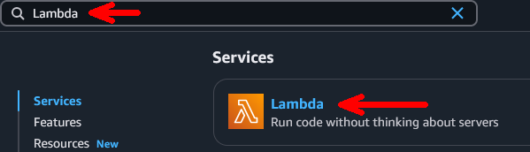

- **Paso 2.** Clic en **"Create function"**.

  **NOTA:** La interfaz del botón puede variar.

  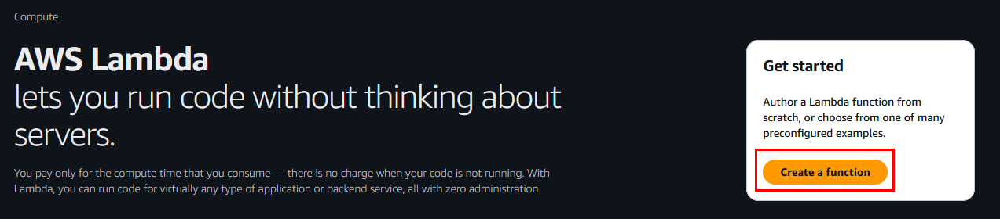

- **Paso 3.** Seleccionar la opción **Author from scratch**.
    
  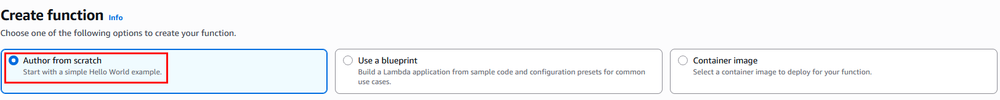

- **Paso 4.** En la seccion **Basic information** ingresar los siguientes datos:

  - **Function name**: `s3_data_processor`
  - **Runtime**: `Python 3.13`
  - **Architecture**: `x86_64`
  
  ---
  
  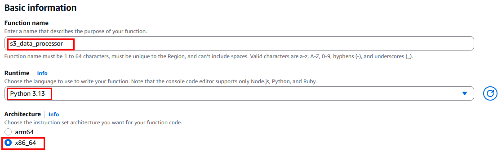

- **Paso 5.** Clic en **Create function**.

### Tarea 2.2 – Código de la función

- **Paso 6.** En la pestaña **Code**, reemplaza el código con:

  ```python
  import json
  import boto3
  import csv
  import io

  def lambda_handler(event, context):
      bucket = event['Records'][0]['s3']['bucket']['name']
      key = event['Records'][0]['s3']['object']['key']
        
      s3 = boto3.client('s3')
      response = s3.get_object(Bucket=bucket, Key=key)
      content = response['Body'].read().decode('utf-8')
        
      reader = csv.DictReader(io.StringIO(content))
        
      total_unidades = 0
        
      for row in reader:
          unidades = row.get('Unidades', '').strip()
          if unidades.isdigit():
              total_unidades += int(unidades)
        
      return {
          'statusCode': 200,
          'body': json.dumps({
              'total_unidades': total_unidades
          })
      }

  ```
  
  ---
  
  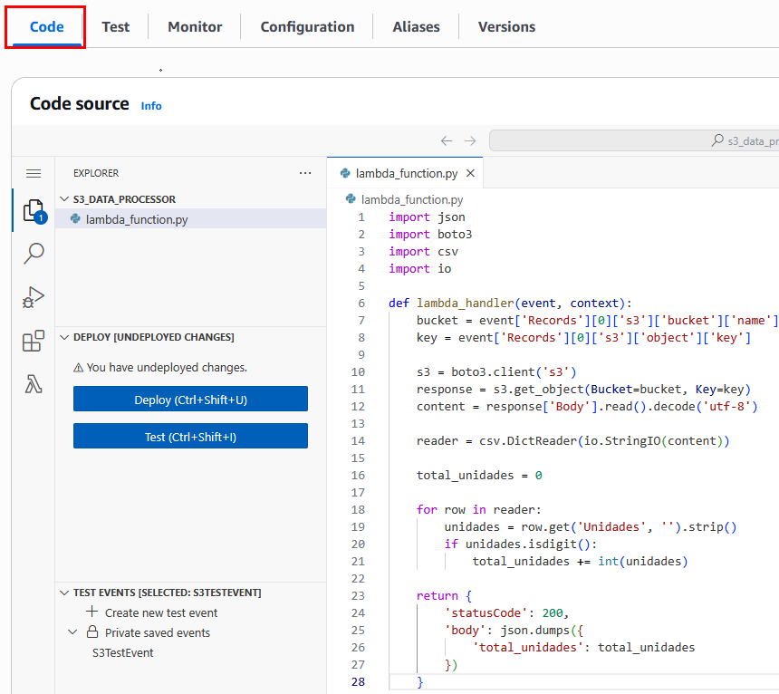

- **Paso 7.** Haz clic en **Deploy**.

  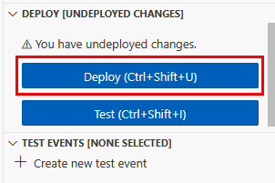
  
  ---
  
  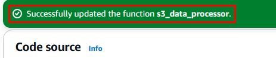

### Tarea 2.3 – Validaciones

- **Paso 8.** Ahora verifica la creación de la función en la sección **Configuration** -> **General configuration**:

  **NOTA:** Edita la sección de **General Configuration** para ajustar el tiempo a **10 segundos**
   
  - Memory: 128 MB
  - Timeout: 10 segundos
  
  ---
  
  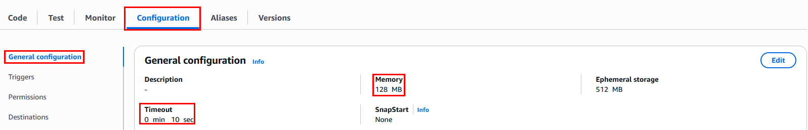

- **Paso 9.** Ir al servicio **IAM** → **Roles** → Busca el rol asignado debe comenzar con `s3_data_processor...`
        
  - Asegúrate de que tiene: `AWSLambdaBasicExecutionRole`
  
  ---
  
  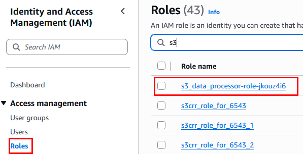
  
  ---
  
  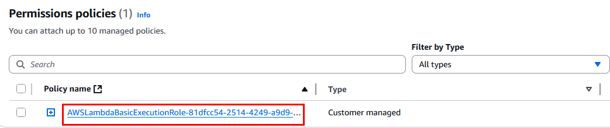

> **TAREA FINALIZADA**

**Resultado esperado:** Función `s3_data_processor` desplegada, lista para conectarse con S3.

---

## Tarea 3: Crear función Lambda para API Gateway (`api_data_receiver`)

**Descripción:** Crear una función Lambda que reciba peticiones JSON desde API Gateway.

### Tarea 3.1 – Crear la función

- **Paso 1.** En el panel de Lambda, haz clic en **"Create function"**.

  
  
  ---
  
  
  
  ---
  
      

- **Paso 2.** Selecciona **Author from scratch** y configura los campos:

  - **Function name**: `api_data_receiver`
  - **Runtime**: `Python 3.13`
  - **Architecture**: `x86_64`
  
  ---
  
    
  
  ---
  
  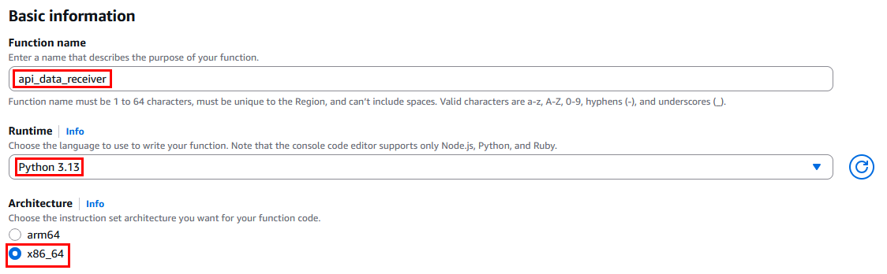 

- **Paso 3.** Haz clic en **Create function**.

### Tarea 3.2 – Código de la función

- **Paso 4.** En la pestaña **Code**, reemplaza el código con:

  ```python
  import json

  def lambda_handler(event, context):
      print("Evento recibido desde API Gateway:")
      print(json.dumps(event))

      try:
          data = json.loads(event['body'])
          name = data.get('name', 'desconocido')
          return {
              'statusCode': 200,
              'body': json.dumps(f'Hola {name}, los datos fueron recibidos correctamente.')
          }
      except Exception as e:
          return {
              'statusCode': 400,
              'body': json.dumps(f'Error en los datos: {str(e)}')
          }
  ```
  
  ---
  
  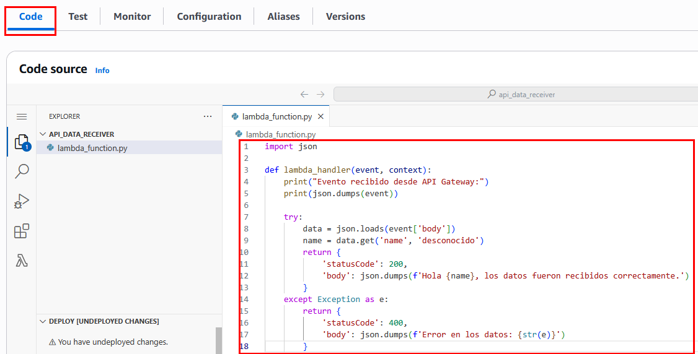 

- **Paso 5.** Haz clic en **Deploy**.

  
  
  ---
  
  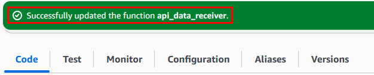


### Tarea 3.3 – Validaciones

- **Paso 6.** Ahora verifica la creación de la función en la sección **Configuration** -> **General configuration**:

  **NOTA:** Edita la sección de **General Configuration** para ajustar el tiempo a **10 segundos**

  - Memory: 128 MB
  - Timeout: 10 segundos
  
  ---
  
  

- **Paso 7.** Ir al servicio **IAM** → **Roles** → Busca el rol asignado debe comenzar con `api_data_receiver...`
        
  - Asegúrate de que tiene: `AWSLambdaBasicExecutionRole`
  
  ---
  
  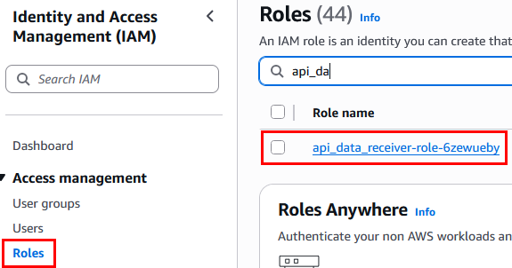
  
  ---
  
  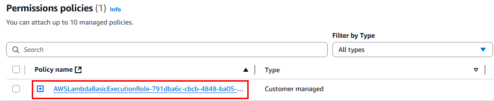

> **TAREA FINALIZADA**

**Resultado esperado:** Función `api_data_receiver` desplegada correctamente y lista para integrarse con una API REST.

---

> **¡FELICIDADES HAZ COMPLETADO EL LABORATORIO 4!**

## Resultado final

Se han creado dos funciones Lambda funcionales en la región `us-west-2`:

- `s3_data_processor`: preparada para conectarse con eventos de carga en S3.
- `api_data_receiver`: preparada para integrarse con API Gateway y recibir datos JSON.

Ambas cuentan con el entorno Python 3.13, rol de ejecución válido, configuración básica validada y despliegue exitoso.

---

## URLS de referencia

- [AWS Lambda: Crear función desde cero](https://docs.aws.amazon.com/lambda/latest/dg/getting-started-create-function.html)
- [Lambda + S3 Eventos](https://docs.aws.amazon.com/lambda/latest/dg/with-s3.html)
- [Lambda + API Gateway](https://docs.aws.amazon.com/lambda/latest/dg/services-apigateway.html)
- [Roles de ejecución para Lambda](https://docs.aws.amazon.com/lambda/latest/dg/lambda-intro-execution-role.html)

---

**[⬅️ Atrás](https://netec-mx.github.io/TPRACT_INGDAT_Priv/Capítulo3/lab3.html)** | **[Lista General](https://netec-mx.github.io/TPRACT_INGDAT_Priv/)** | **[Siguiente ➡️](https://netec-mx.github.io/TPRACT_INGDAT_Priv/Capítulo3/lab5.html)**
