# Práctica 5: Configuración de eventos disparadores (S3 y API Gateway)

## Objetivo

Configurar los eventos que activarán funciones Lambda creadas en la Práctica 4:
- Un evento de tipo **"PutObject"** desde Amazon S3 que active la función `s3_data_processor`
- Un evento de tipo **"Invoke URL REST POST"** mediante API Gateway que active `api_data_receiver`

## Requisitos

- Haber completado la Práctica 4 y tener ambas funciones Lambda creadas.
- Bucket de S3 existente: `lab-databucket-xxxxx`
- Permisos IAM para Lambda, S3, API Gateway y IAM Role.

## Duración aproximada

- 120 minutos

## Región de AWS

- us-west-2 (Oregón)

---

**[⬅️ Atrás](https://netec-mx.github.io/TPRACT_INGDAT_Priv/Capítulo3/lab4.html)** | **[Lista General](https://netec-mx.github.io/TPRACT_INGDAT_Priv/)** | **[Siguiente ➡️](https://netec-mx.github.io/TPRACT_INGDAT_Priv/Capítulo3/lab6.html)**

---

## Instrucciones

## Tarea 1: Iniciar sesión en la consola AWS

**Descripción:** Acceder como usuario IAM.

### Tarea 1.1

- **Paso 1.** Ir a [AWS Console](https://aws.amazon.com/console)

- **Paso 2.** Clic en **Sign in**

- **Paso 3.** Iniciar sesión con:

  - Account ID or alias: `Cuenta asignada en el curso`
  - IAM username: `Asignado en el curso`
  - Password: `Asignada en el curso`

- **Paso 4.** Verificar que estás en la región `us-west-2`

    

> **TAREA FINALIZADA**

**Resultado esperado:** Acceso exitoso a la consola.

---

## Tarea 2: Conectar Lambda con evento de carga en S3

**Descripción:** Activar automáticamente la función `s3_data_processor` cuando se cargue un archivo al bucket `lab-databucket-xxxxx`.

### Tarea 2.1 – Agregar trigger desde Lambda

- **Paso 1.** Ir al servicio **Lambda** → selecciona la función `s3_data_processor`.

  

- **Paso 2.** En la pestaña **Configuration**, selecciona **Triggers**.

  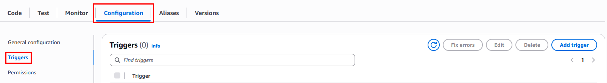

- **Paso 3.** Haz clic en **"Add trigger"**.

  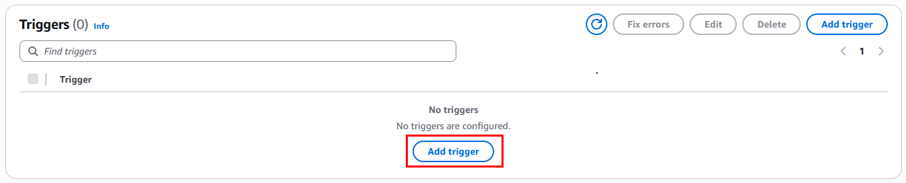

- **Paso 4.** En el menú desplegable, elige **S3**.

  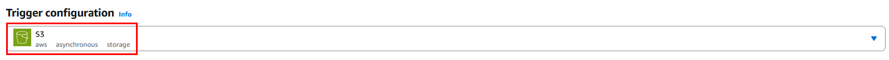

- **Paso 5.** Configura los siguientes datos:

  **IMPORTANTE:** Elige el nombre del bucket que te fue **asignado** al curso

  - Bucket: `lab-databucket-xxxxx`
  - Event type: `PUT` (para nuevos objetos)
  - Prefix (opcional): `rawdata//`
  - Suffix (opcional): `.csv`
  
  ---
  
  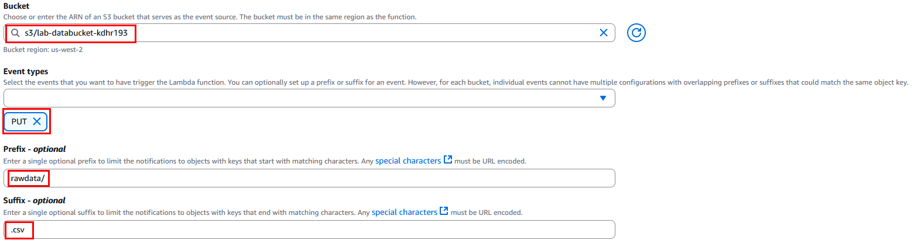

- **Paso 6.** Marca el check de **Recursive invocation**.

  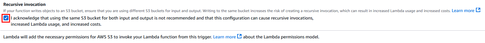

- **Paso 7.** Haz clic en **Add**.

  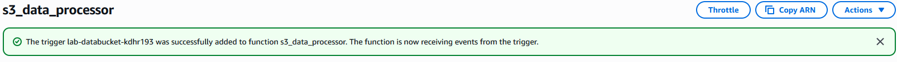

### Tarea 2.2 – Validar permisos del rol Lambda

- **Paso 8.** Ir a **IAM → Roles** → Buscar el rol de `s3_data_processor`.

  
  
  ---
  
  

- **Paso 9.** Asegúrate que contiene permisos necesarios, agrega la siguiente politica `AmazonS3FullAccess`:

  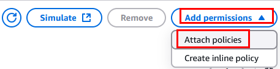
  
  ---
  
  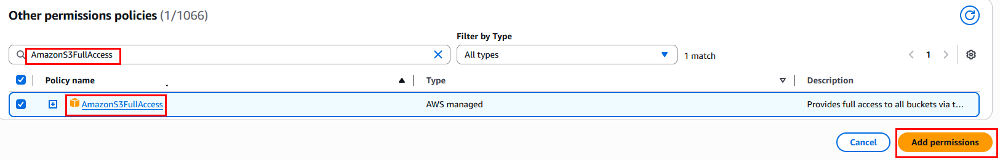
  
  ---
  
  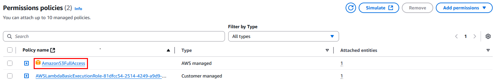

> **Importante**: Si no está, deberás adjuntar manualmente una política con esos permisos.

> **TAREA FINALIZADA**

**Resultado esperado:** La función `s3_data_processor` será invocada automáticamente al cargar un archivo CSV en el bucket.

---

## Tarea 3: Conectar Lambda con API Gateway

**Descripción:** Crear un endpoint público HTTP tipo POST en API Gateway que invoque la función `api_data_receiver`.

### Tarea 3.1 – Crear una API REST

- **Paso 1.** Ve al servicio **API Gateway**.

  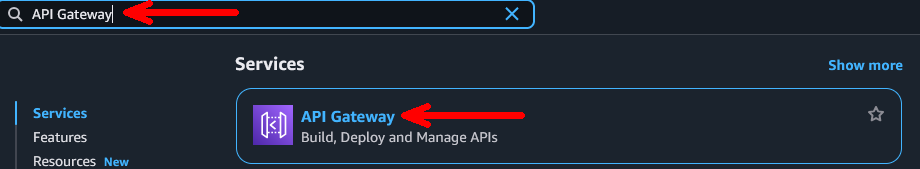

- **Paso 2.** Selecciona **"APIs"** → **Create API**.

  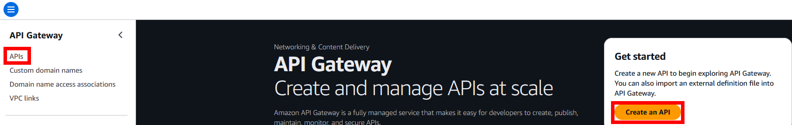

- **Paso 3.** En la sección **HTTP API** da clic en **Build**.

  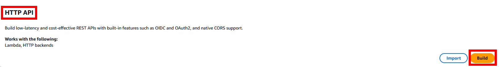

- **Paso 4.** Escribe el nombre api: `api-processing-xxxx`

  **NOTA:** Sustituye las **`x`** por letras y numeros aleatorios.
  
  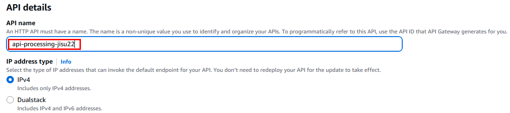

- **Paso 5.** En **Integrations**, clic en **Add integration** y selecciona **Lambda**.

  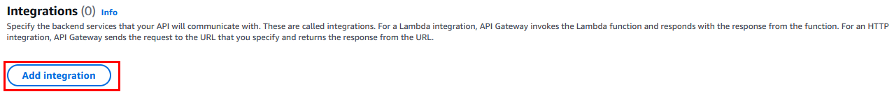
  
  ---
  
  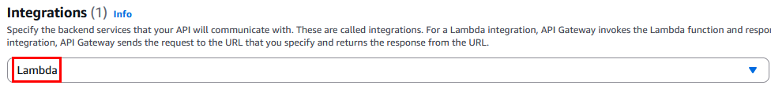

- **Paso 6.** Elige la función `api_data_receiver`, verifica que la región sea **us-west-2**.

  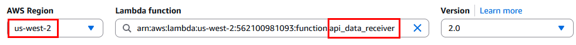

- **Paso 7.** Haz clic en **Next**.

### Tarea 3.2 – Configurar ruta y método

- **Paso 8.** En la sección de **Configure routes - optional** configura lo siguiente:
    
  - Method: `POST`
  - Resource path: `/ingest-data`
  
  ---
  
  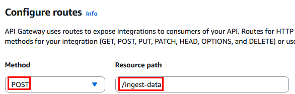

- **Paso 9.** Confirmar integración con Lambda.

  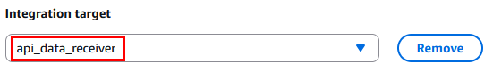

- **Paso 10.** Da clic en **Next**.

- **Paso 11.** En la sección **Define stages - optional** clic **Next**

- **Paso 12.** En la sección **Review and create** clic en **Create**

  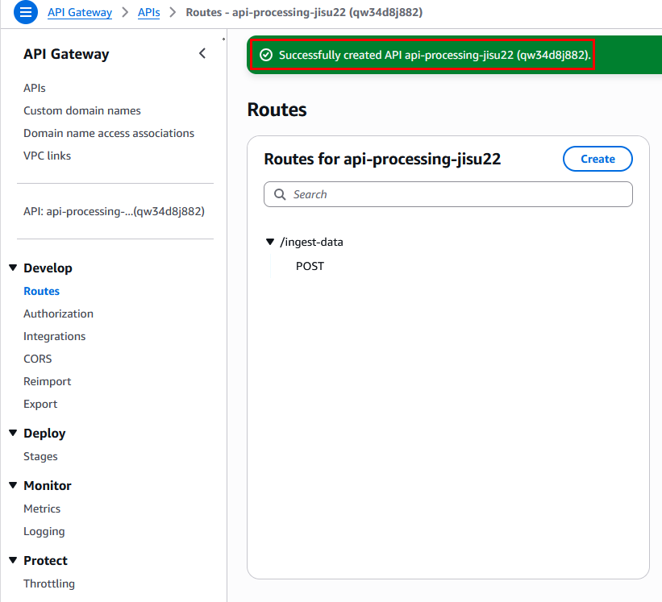

- **Paso 13.** Ahora da clic en la opción **Stages** de la sección **Deploy**

  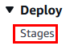

- **Paso 14.** Selecciona el ambiente predeterminado **$default** y copia la URL de invocación, guardala en un bloc de notas la usaras mas adelante.

  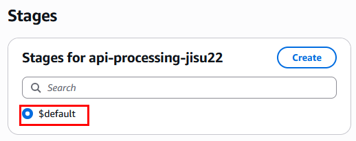
  
  ---
  
  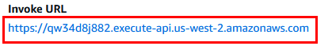
  
  ---
  
  > La consola mostrará una URL como: `https://abc123xyz.execute-api.us-west-2.amazonaws.com/ingest-data`. Guarda esa URL para las pruebas.

> **TAREA FINALIZADA**

**Resultado esperado:** Endpoint HTTP POST creado con integración a `api_data_receiver`.

---

> **¡FELICIDADES HAZ COMPLETADO EL LABORATORIO 5!**

## Resultado final

- El bucket S3 `lab-databucket-xxxxx` fue integrado correctamente a la funcion lambda 
- La función `api_data_receiver` fue integrada correctamente a la funcion lambda  

---

## URLS de referencia

- [Lambda + S3: eventos automáticos](https://docs.aws.amazon.com/lambda/latest/dg/with-s3.html)
- [Lambda + API Gateway HTTP](https://docs.aws.amazon.com/lambda/latest/dg/services-apigateway.html)
- [Permisos IAM para S3 triggers](https://docs.aws.amazon.com/lambda/latest/dg/access-control-resource-based.html)
- [API Gateway - Crear endpoint HTTP](https://docs.aws.amazon.com/apigateway/latest/developerguide/http-api.html)

---

**[⬅️ Atrás](https://netec-mx.github.io/TPRACT_INGDAT_Priv/Capítulo3/lab4.html)** | **[Lista General](https://netec-mx.github.io/TPRACT_INGDAT_Priv/)** | **[Siguiente ➡️](https://netec-mx.github.io/TPRACT_INGDAT_Priv/Capítulo3/lab6.html)**