# Práctica 6: Ejecución y monitoreo de funciones Lambda

## Objetivo

Ejecutar y monitorear dos funciones Lambda (`s3_data_processor` y `api_data_receiver`) creadas en prácticas anteriores, validando su comportamiento con datos reales y simulados desde la consola de AWS y desde herramientas externas (curl/Postman). Además, utilizar **CloudWatch Logs** y **CloudWatch Metrics** para validar ejecución, errores y tiempos.

## Requisitos

- Haber completado la Práctica 4 (creación de funciones) y Práctica 5 (conexión con eventos).
- Acceso como usuario IAM con permisos sobre Lambda, CloudWatch, S3 y API Gateway.
- Tener configurado el bucket `lab-databucket-xxxxx` y el endpoint de API Gateway activo.

## Duración aproximada

- 120 minutos

## Región de AWS

- us-west-2 (Oregón)

---

**[⬅️ Atrás](https://netec-mx.github.io/TPRACT_INGDAT_Priv/Capítulo3/lab5.html)** | **[Lista General](https://netec-mx.github.io/TPRACT_INGDAT_Priv/)** | **[Siguiente ➡️](https://netec-mx.github.io/TPRACT_INGDAT_Priv/Capítulo4/lab7.html)**

---

## Instrucciones

## Tarea 1: Iniciar sesión en la consola AWS

**Descripción:** Acceder como usuario IAM.

### Tarea 1.1

- **Paso 1.** Ir a [AWS Console](https://aws.amazon.com/console)

- **Paso 2.** Clic en **Sign in**

- **Paso 3.** Iniciar sesión con:

  - Account ID or alias: `Cuenta asignada en el curso`
  - IAM username: `Asignado en el curso`
  - Password: `Asignada en el curso`

- **Paso 4.** Verificar que estás en la región `us-west-2`

    

> **TAREA FINALIZADA**

**Resultado esperado:** Acceso exitoso a la consola.

---

## Tarea 2: Ejecutar función `s3_data_processor` manualmente

**Descripción:** Simular desde la consola un evento S3 para probar la función sin necesidad de subir un archivo.

### Tarea 2.1 – Evento de prueba simulado

- **Paso 1.** Ir a **Lambda** → función `s3_data_processor`

  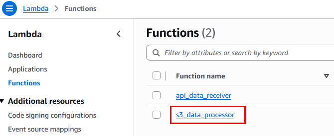

- **Paso 2.** En pestaña **Code**, haz clic en **"Test"**

  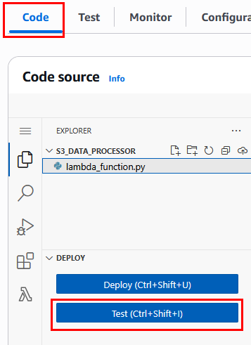

- **Paso 3.** En la ventana central emergente da clic en **Create new test event**

  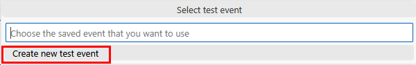

- **Paso 4.** Crear un nuevo evento de prueba:

  - Event name: `S3TestEvent`
  - Template - optional: `S3 Put`
  
  ---
  
  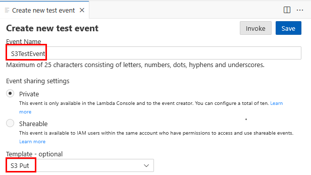

- **Paso 5.** En el apartado **Event JSON** borra el codigo actual y pega el siguiente en este paso:

  **NOTA:** Recuerda modificar el nombre de tu bucket asignado al curso.

  ```json
  {
  "Records": [
      {
      "s3": {
          "bucket": {
          "name": "lab-databucket-xxxxxxx"
          },
          "object": {
          "key": "data/ventas.csv"
          }
      }
      }
  ]
  }
  ```
  
  ---
  
  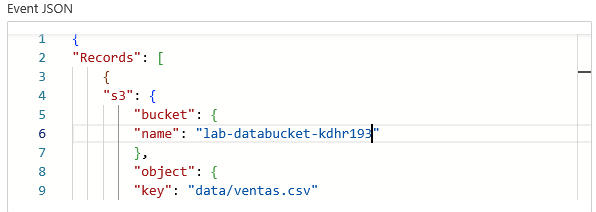

- **Paso 6.** Haz clic en **Save** y luego en **Invoke**

  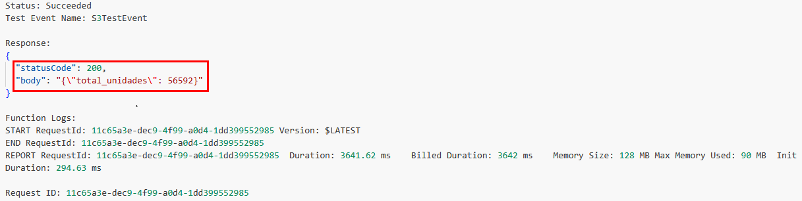

> **TAREA FINALIZADA**

**Resultado esperado:** Ejecución exitosa con retorno `200 OK` y mensaje `total_unidades: 56592`

---

## Tarea 3: Ejecutar función `api_data_receiver` manualmente

**Descripción:** Simular una petición desde API Gateway usando un evento HTTP POST.

### Tarea 3.1 – Prueba desde Lambda

- **Paso 1.** Ir a función `api_data_receiver`

  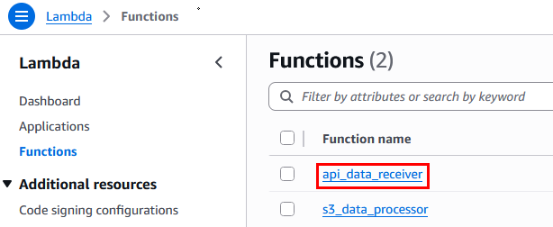

- **Paso 2.** En pestaña **Code**, haz clic en **"Test"**

  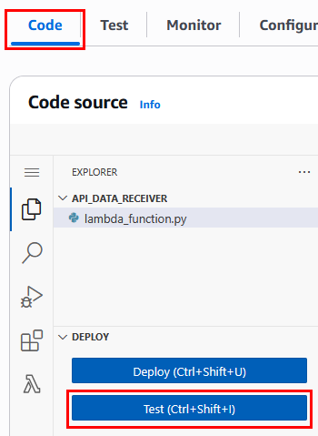

- **Paso 3.** En la ventana central emergente da clic en **Create new test event**

  

- **Paso 4.** Crear evento nuevo con los siguientes datos:

  - Event name: `APITestEvent`
  - Template - optional: `Hello World`
  
  ---
  
  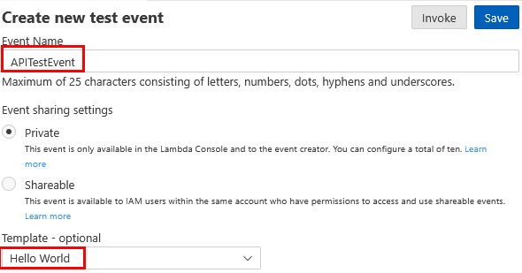

- **Paso 5.** En el apartado **Event JSON** borra el codigo actual y pega el siguiente en este paso:

  ```json
  {
  "body": "{\"name\":\"Data Processing\"}"
  }
  ```
  
  ---
  
  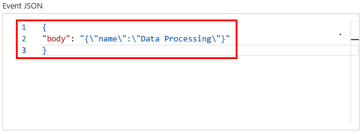

- **Paso 6.** Haz clic en **Save** y luego en **Invoke**

  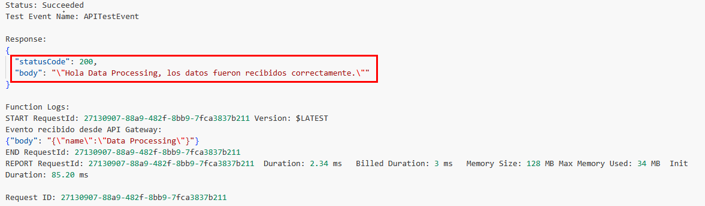

> **TAREA FINALIZADA**

**Resultado esperado:** Respuesta `200 OK` con mensaje `"Hola Data Processing, los datos fueron recibidos correctamente."`

---

## Tarea 4: Ejecutar funciones con eventos reales

### Tarea 4.1 – Evento real a S3

- **Paso 1.** Ir al servicio **S3** y dar clic en **General purpose buckets**

  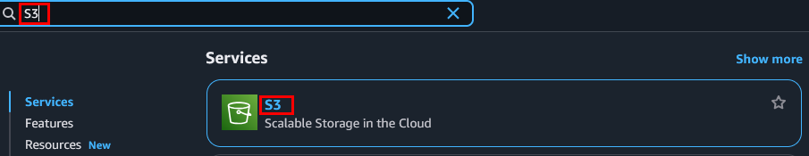
  
  ---
  
  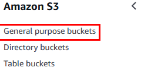

- **Paso 2.** Da clic en el bucket llamado **`lab-databucket-xxxx`**.

  **NOTA:** Recuerda dar clic al bucket que te asignaron en el curso.

  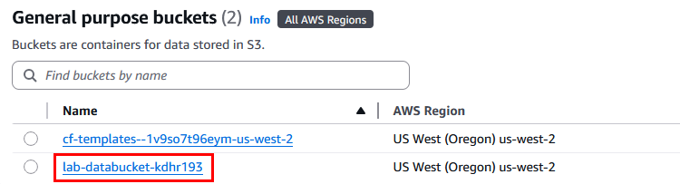

- **Paso 3.** Crear carpeta llamada `rawdata`.

  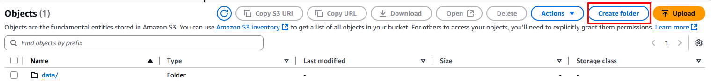
  
  ---
  
  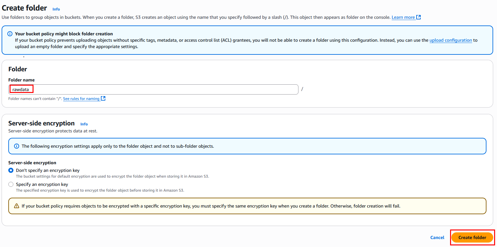
  
  ---
  
  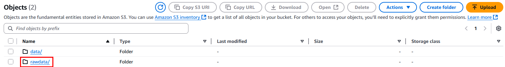

- **Paso 4.** Da clic en la carpeta llamada **data** y dentro de la carpeta descarga el archivo **ventas.csv**

  **NOTA:** Guarda el archivo **ventas.csv** en tu escritorio.

  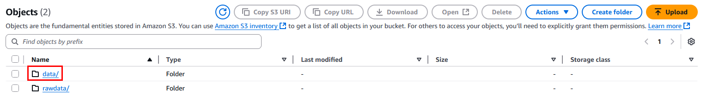
  
  ---
  
  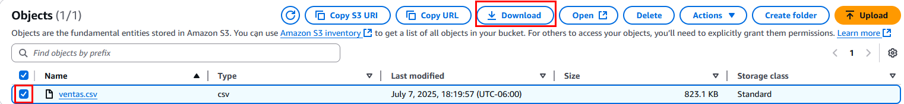    

- **Paso 5.** Ahora dentro de la carpeta **rawdata** carga el archivo **ventas.csv**

  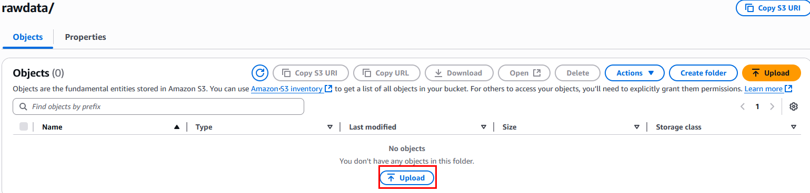
  
  ---
  
  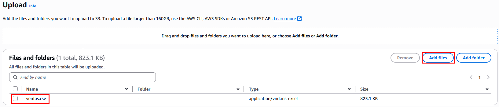    

- **Paso 6.** Clic en el botón **Upload**

- **Paso 7.** El archivo se cargara correctamente, puedes dar clic en **Close**

  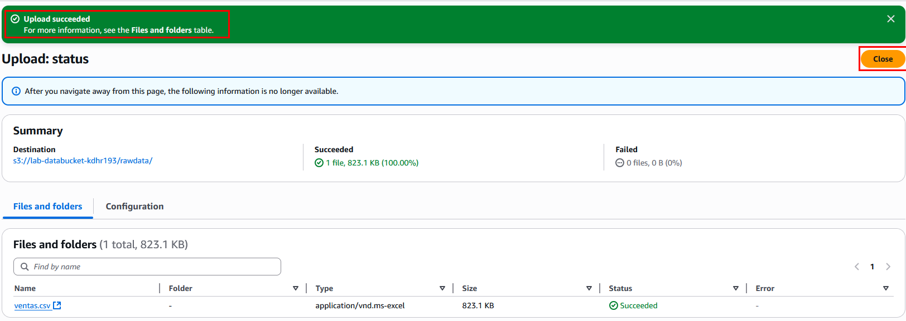 

### Tarea 4.2 – Llamada real a API Gateway

- **Paso 8.** Usar la URL pública del endpoint creado en Práctica 5:

  **NOTA:** Recuerda sustituir la URL que guardaste en la práctica anterior.

  ```bash
  curl -X POST https://abc123xyz.execute-api.us-west-2.amazonaws.com/ingest-data \
  -H "Content-Type: application/json" \
  -d '{"name": "LambdaUser"}'
  ```
  
  ---
  
  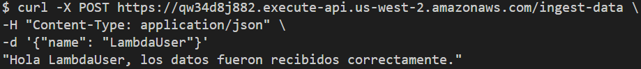

- **Paso 9.** Para realizar la prueba del paso anterior, puedes usar la **terminal BASH de tu equipo de trabajo**, **AWS CloudShell**, descargar **POSTMAN** u otra herramienta para la llamada de APIs. 

> **TAREA FINALIZADA**

**Resultado esperado:** Ambas pruebas fueron ejecutadas correctamente.

---

## Tarea 5: Monitoreo desde CloudWatch

**Descripción:** Visualizar logs y métricas para ambas funciones.

### Tarea 5.1 – Ver logs

- **Paso 1.** Ir a **Lambda** → función `s3_data_processor`

  

- **Paso 2.** Da clic en la opción **Monitor**

  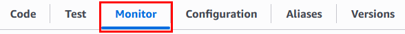

- **Paso 3.** Da clic en la opción **View CloudWatch logs** para que puedas investigar los eventos. La lambda ejecuta correctamente pero no imprime resultados en los logs.

  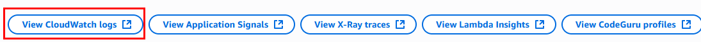

- **Paso 4.** Dependiendo de las veces ejecutas es la cantidad de **Log Streams** que apareceran. Puedes investigar por tu cuenta los logs

  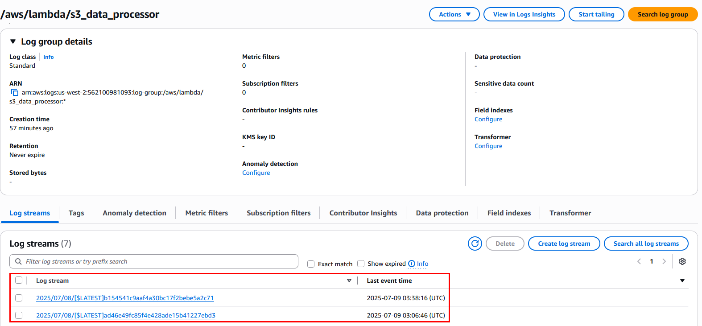

- **Paso 5.** Ahora ve a la función `api_data_receiver`

  

- **Paso 6.** Repite el `Paso 2` y el `Paso 3`.

- **Paso 7.** Dependiendo de las veces ejecutas es la cantidad de **Log Streams** que apareceran. Puedes investigar por tu cuenta los logs

  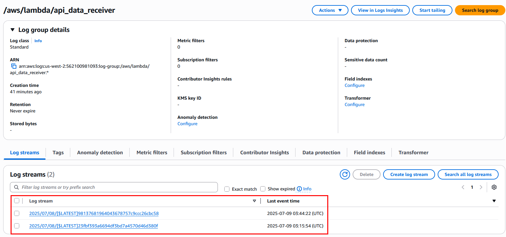

### Tarea 5.2 – Ver métricas

- **Paso 8.** Ir a **Lambda** → función `s3_data_processor`

  

- **Paso 9.** Da clic en la opción **Monitor**

  

- **Paso 10.** Puedes ver varias metricas.

  - Invocations
  - Duration
  - Errors
  - Entre otras metricas
  
  ---
  
  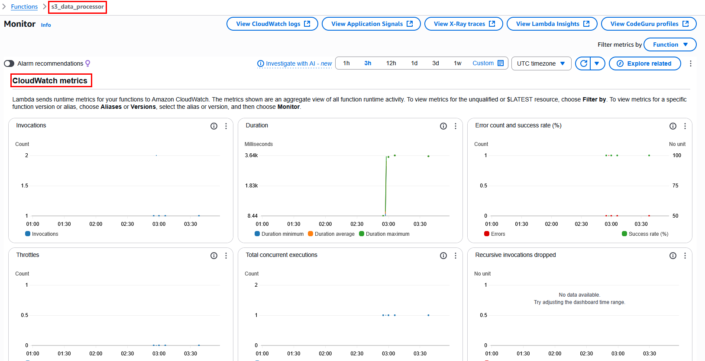

- **Paso 11.** Ahora ve a la función `api_data_receiver`

  

- **Paso 12.** Da clic en la opción **Monitor**

  

- **Paso 13.** Puedes ver varias metricas.

  - Invocations
  - Duration
  - Errors
  - Entre otras metricas
  
  ---
  
  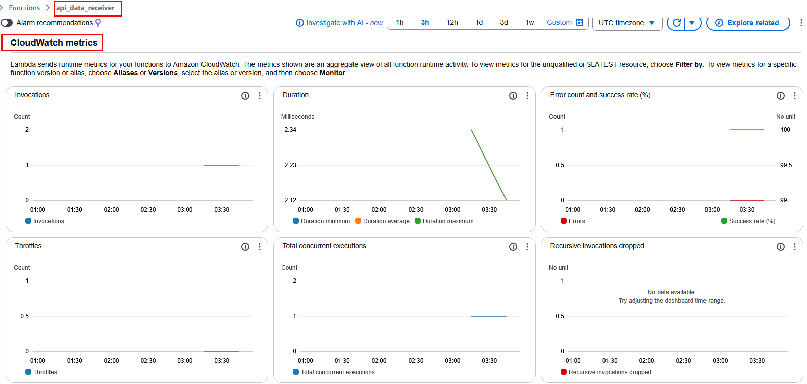

> **TAREA FINALIZADA**

**Resultado esperado:** Ambas funciones registran ejecuciones exitosas. No hay errores, y la duración es consistente (<10s).

---

> **¡FELICIDADES HAZ COMPLETADO EL LABORATORIO 6!**

## Resultado final

- Las funciones `s3_data_processor` y `api_data_receiver` han sido ejecutadas manualmente y por eventos reales.
- Se verificaron los resultados mediante logs en CloudWatch.
- Se monitorearon las métricas clave de ejecución y errores.
- El entorno está listo para una solución completa de ingesta y procesamiento.

---

## URLS de referencia

- [Lambda Test Events](https://docs.aws.amazon.com/lambda/latest/dg/testing-functions.html)
- [Monitorear funciones con CloudWatch Logs](https://docs.aws.amazon.com/lambda/latest/dg/monitoring-functions-logs.html)
- [Ver métricas Lambda en CloudWatch](https://docs.aws.amazon.com/lambda/latest/dg/monitoring-metrics.html)
- [Log Insights para Lambda](https://docs.aws.amazon.com/AmazonCloudWatch/latest/logs/AnalyzingLogData.html)

---

**[⬅️ Atrás](https://netec-mx.github.io/TPRACT_INGDAT_Priv/Capítulo3/lab5.html)** | **[Lista General](https://netec-mx.github.io/TPRACT_INGDAT_Priv/)** | **[Siguiente ➡️](https://netec-mx.github.io/TPRACT_INGDAT_Priv/Capítulo4/lab7.html)**