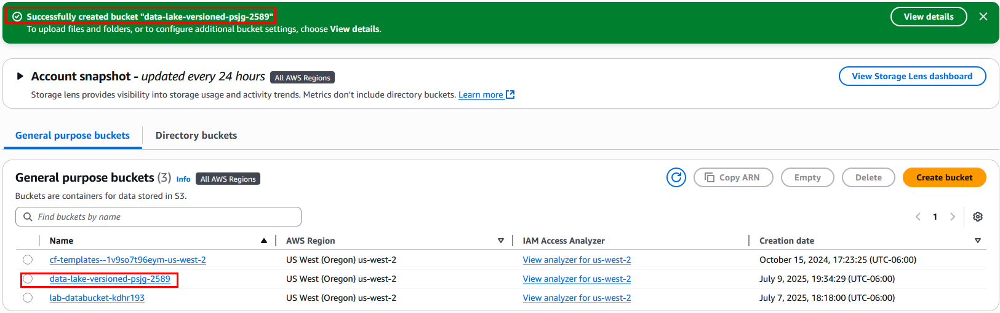
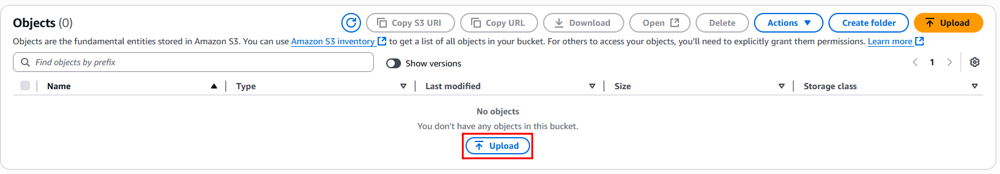

# Práctica 7: Creación de un bucket S3 y activación de versionamiento

## Objetivo

Crear un bucket S3 configurado con versionamiento habilitado en la región **us-west-2 (Oregón)**, y validar que cada archivo modificado o reemplazado genera una nueva versión automáticamente.

## Requisitos

- Usuario IAM con permisos sobre Amazon S3 (`s3:*`).
- Conexión a internet y navegador actualizado.
- Conocimiento básico de AWS S3, enfoque en control de datos y auditoría.

## Duración aproximada

- 20 minutos

## Región de AWS

- us-west-2 (Oregón)

---

**[⬅️ Atrás](https://netec-mx.github.io/TPRACT_INGDAT_Priv/Capítulo3/lab6.html)** | **[Lista General](https://netec-mx.github.io/TPRACT_INGDAT_Priv/)** | **[Siguiente ➡️](https://netec-mx.github.io/TPRACT_INGDAT_Priv/Capítulo4/lab8.html)**

---

## Instrucciones

## Tarea 1: Iniciar sesión en la consola AWS

**Descripción:** Acceder como usuario IAM.

### Tarea 1.1

- **Paso 1.** Ir a [AWS Console](https://aws.amazon.com/console)

- **Paso 2.** Clic en **Sign in**

- **Paso 3.** Iniciar sesión con:

  - Account ID or alias: `Cuenta asignada en el curso`
  - IAM username: `Asignado en el curso`
  - Password: `Asignada en el curso`

- **Paso 4.** Verificar que estás en la región `us-west-2`

    

> **TAREA FINALIZADA**

**Resultado esperado:** Acceso exitoso a la consola.

---

## Tarea 2: Crear un bucket S3 con nombre único

**Descripción:** Crear un bucket con nombre global único para evitar colisiones.

### Tarea 2.1

- **Paso 1.** Buscar y abrir el servicio **S3** desde la consola.

  

- **Paso 2.** Clic en **"Create bucket"**

  

- **Paso 3.** En el nombre del bucket sustiuye el las `x` por letras aleatorias y el simbolo `#` por numeros:

  - **Region**: `US West (Oregon) - us-west-2`
  - **Bucket type**: `General purpose`
  - **Bucket name**: `data-lake-versioned-xxxx-####` (ej. `data-lake-versioned-pctm-202507`)
  
  ---

  

### Tarea 2.2 – Configuración adicional

- **Paso 4.** Deja activado **"Block all public access"**.

  **NOTA:** Solo si vas a realizar pruebas con acceso público controlado se deshabilita. Deja activado por seguridad.

  

- **Paso 5.** Deja la opción **"Default encryption"** activada por seguridad.

  

- **Paso 6.** Haz clic en **"Create bucket"**

  

> **TAREA FINALIZADA**

**Resultado esperado:** Bucket creado exitosamente y visible en la consola.

---

## Tarea 3: Activar versionamiento en el bucket

**Descripción:** Activar el control de versiones para guardar el historial de cada objeto.

### Tarea 3.1

- **Paso 1.** Dentro de S3, haz clic en el bucket recién creado.

  

- **Paso 2.** Ve a la pestaña **“Properties”**

  

- **Paso 3.** Busca la sección **“Bucket Versioning”**

  

- **Paso 4.** Haz clic en **“Edit”**

  

- **Paso 5.** Activa **“Enable versioning”**

  

- **Paso 6.** Haz clic en **“Save changes”**

  

> **TAREA FINALIZADA**

**Resultado esperado:** Versionamiento activado en el bucket.

---

## Tarea 4: Subir múltiples versiones del mismo archivo

**Descripción:** Subir un archivo varias veces con el mismo nombre para generar versiones distintas.

### Tarea 4.1

- **Paso 1.** Ir a la pestaña **Objects** del bucket.

  

- **Paso 2.** Descarga el siguiente archivo que usaras para la prueba de las versiones

  Descargar ---> [dataset.csv](https://s3.us-west-2.amazonaws.com/labs.netec.com/courses/TallerPracIngDatos/dataset.csv)

  **NOTA:** El archivo cuenta solo con 4 registros para la prueba. Puedes abrirlo para analizar la informacion demostrativa

- **Paso 3.** Ya descargado regresa a la interfaz de Amazon S3 y haz clic en **“Upload”**

  

- **Paso 4.** Sube el archivo llamado `dataset.csv` (con el texto simulado).

  

- **Paso 5.** Da clic en **Upload** y luego clic en **Close**.

- **Paso 6.** Ahora da clic en el botón llamado **Show versions** y observa la primera version cargada.

  

- **Paso 7.** En tu computadora abre el archivo descargado **dataset.csv** y editalo para agregar **mas registros**.

  **NOTA:** Puedes copiar y pegar los registros existentes, solo para la prueba.

  

- **Paso 8.** Guarda el archivo **dataset.csv** con los cambios

- **Paso 9.** Luego repite el proceso subiendo el archivo **con el mismo nombre** `dataset.csv` pero con contenido diferente (ya modificado localmente).

- **Paso 10.** Ya cargado el archivo **dataset.csv** con los cambios activa la opcioón **Show versions**

- **Paso 11.** Observa que tienes ahora 2 versiones del mismo archivo **dataset.csv**

    

- **Paso 12.** Repite una tercera vez los pasos.

  - Edita el archivo agregando o borrando celdas.
  - Sube el archivo **dataset.csv**.
  - Activa **Show versions**
  - Analiza las versiones.

  ---

   

> **TAREA FINALIZADA** 

**Resultado esperado:** S3 conservará las distintas versiones de `dataset.csv`.

---

## Tarea 5: Validar historial de versiones

### Tarea 5.1

- **Paso 1.** En el bucket, habilita la opción **“Show versions”** en la vista de objetos.

- **Paso 2.** Verifica que `dataset.csv` muestra varias versiones:

  - Identificador de versión (Version ID)
  - Fecha de modificación
  - Tamaño de cada versión

  ---

  

### Tarea 5.2 – Recuperar una versión anterior

- **Paso 3.** Selecciona una versión específica del archivo.

  

- **Paso 4.** Usa la opción **“Download”** para verificar su contenido.

  

- **Paso 5.** Ahora desactiva la opción **Show Versions** para visualizar solo el archivo **dataset.csv** mas reciente.

  

- **Paso 6.** Selecciona el archivo y da clic en el botón **Delete**.

  

- **Paso 7.** En la venta de **Delete objects** confirma el borrado escribiendo: `delete`

  

- **Paso 8.** Clic en el botón **Delete objects** y clic en **Close**

- **Paso 9.** Confirma que ya no tienes ningun objecto.

  

- **Paso 10.** Activa **Show versions**. ¡Sorpresa! ahí tienes tus versiones. Puedes ocupar alguna de ellas para restaurar el objeto borrado.

  

  **NOTA:** Como puees observar el objeto realmente no se borro, con el versionamiento de S3 evitas borrados accidentales.

> **TAREA FINALIZADA** 

**Resultado esperado:** Puedes visualizar y descargar versiones específicas de un mismo archivo.

---

> **¡FELICIDADES HAZ COMPLETADO EL LABORATORIO 7!**

## Resultado final

- Se ha creado un bucket exclusivo para datos versionados.
- Se ha activado el control de versiones correctamente.
- Se ha probado el comportamiento del versionamiento al sobrescribir archivos.
- El bucket ahora está listo para usarse en pipelines de datos donde la trazabilidad y auditoría son esenciales (No incluido en este curso)

---

## URLS de referencia

- [Introducción a S3 Versioning](https://docs.aws.amazon.com/AmazonS3/latest/userguide/Versioning.html)
- [AWS S3 – Crear y configurar buckets](https://docs.aws.amazon.com/AmazonS3/latest/userguide/create-bucket-overview.html)
- [Comandos CLI para S3 Versioning](https://docs.aws.amazon.com/cli/latest/reference/s3api/get-bucket-versioning.html)
- [Versioning y políticas de retención](https://docs.aws.amazon.com/AmazonS3/latest/userguide/object-versioning.html)

---

**[⬅️ Atrás](https://netec-mx.github.io/TPRACT_INGDAT_Priv/Capítulo3/lab6.html)** | **[Lista General](https://netec-mx.github.io/TPRACT_INGDAT_Priv/)** | **[Siguiente ➡️](https://netec-mx.github.io/TPRACT_INGDAT_Priv/Capítulo4/lab8.html)**
