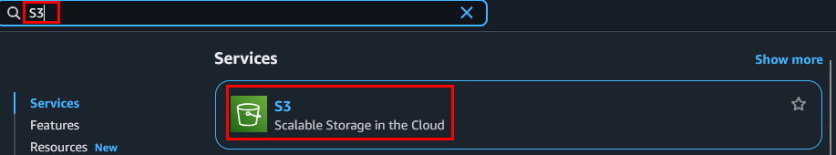

# Práctica 8: Carga y gestión de archivos (almacenamiento histórico / uso frecuente)

## Objetivo

Cargar, organizar y gestionar archivos dentro de un bucket S3, separando claramente entre:

- Archivos de uso frecuente (`/activo/`)
- Archivos históricos (`/historico/`)

Además, aplicar buenas prácticas de organización, realizar pruebas de movimiento entre carpetas, validaciones de acceso, visualización.

## Requisitos 

- Acceso a la consola AWS como usuario IAM.
- Tener disponibles 2 o más archivos locales de prueba:

  - `ventas_actual.csv`
  - `ventas_2022.csv`
  - `respaldo_20-21.csv`

## Duración aproximada

- 120 minutos

## Región de AWS

- us-west-2 (Oregón)

---

**[⬅️ Atrás](https://netec-mx.github.io/TPRACT_INGDAT_Priv/Capítulo4/lab7.html)** | **[Lista General](https://netec-mx.github.io/TPRACT_INGDAT_Priv/)** | **[Siguiente ➡️](https://netec-mx.github.io/TPRACT_INGDAT_Priv/Capítulo4/lab9.html)**

---

## Instrucciones

## Tarea 1: Iniciar sesión en la consola AWS

**Descripción:** Acceder como usuario IAM.

### Tarea 1.1

- **Paso 1.** Ir a [AWS Console](https://aws.amazon.com/console)

- **Paso 2.** Clic en **Sign in**

- **Paso 3.** Iniciar sesión con:

  - Account ID or alias: `Cuenta asignada en el curso`
  - IAM username: `Asignado en el curso`
  - Password: `Asignada en el curso`

- **Paso 4.** Verificar que estás en la región `us-west-2`

    

> **TAREA FINALIZADA**

**Resultado esperado:** Acceso exitoso a la consola.

---

## Tarea 2: Crear estructura lógica dentro de S3

**Descripción:** Crear carpetas base para almacenamiento estructurado.

### Tarea 2.1

- **Paso 1.** Abrir el servicio **Amazon S3**

  

- **Paso 2.** Clic en **"Create bucket"**

  

- **Paso 3.** En el nombre del bucket sustiuye el las `x` por letras aleatorias y el simbolo `#` por numeros:

  - **Region**: `US West (Oregon) - us-west-2`
  - **Bucket type**: `General purpose`
  - **Bucket name**: `data-gestion-xxxx-####` (ej. `data-gestion-pctm-202507`)

  ---

  

- **Paso 4.** Haz clic en **"Create bucket"**

### Tarea 2.2 – Crear carpetas

- **Paso 5.** Dentro de S3, haz clic en el bucket recién creado.

  

- **Paso 6.** Clic en **Objects** y lego en **Create folder**

  

- **Paso 7.** Crea la carpeta llamada: `activo`

  

- **Paso 8.** Clic en **Create folder**

- **Paso 9.** Repite el **Paso 6**

- **Paso 10.** Crea la carpeta llamada: `historico`

  

- **Paso 11.** Clic en **Create folder**

- **Paso 12.** Al final deberas tener 2 folders como resultado.

  

> **TAREA FINALIZADA**

**Resultado esperado:** Bucket con estructura `/activo/` y `/historico/` visible.

---

## Tarea 3: Subir archivos según su tipo

### Tarea 3.1 – Archivos activos

- **Paso 1.** Descarga el siguiente archivo que usaras para las pruebas.

  Descargar ---> [ventas_actual.csv](https://s3.us-west-2.amazonaws.com/labs.netec.com/courses/TallerPracIngDatos/ventas_actual.csv)

- **Paso 2.** Regresa a la sección de **objetos** en la consola de **S3** y da clic en la carpeta **activo/**

  

- **Paso 3.** Da clic en **“Upload”**.Sube el archivo llamado `ventas_actual.csv`.

  

- **Paso 4.** Da clic en **Upload** y luego clic en **Close**.

### Tarea 3.2 – Archivos históricos

- **Paso 5.** Descarga los siguientes archivos que usaras para las pruebas.

  Descargar ---> [ventas_2022.csv](https://s3.us-west-2.amazonaws.com/labs.netec.com/courses/TallerPracIngDatos/ventas_2022.csv)
  
  ---

  Descargar ---> [respaldo_20-21.csv](https://s3.us-west-2.amazonaws.com/labs.netec.com/courses/TallerPracIngDatos/respaldo_20-21.csv)

- **Paso 6.** Regresa a la sección de **objetos** en la consola de **S3** y da clic en la carpeta **historico/**

  

- **Paso 7.** Da clic en **“Upload”**.Sube los archivos llamados `ventas_2022.csv` y `respaldo_20-21.csv`

  

- **Paso 8.** Da clic en **Upload** y luego clic en **Close**.

> **TAREA FINALIZADA**

**Resultado esperado:** Archivos correctamente ubicados.

---

## Tarea 4: Validar integridad de carga

### Tarea 4.1 – Propiedades

- **Paso 1.** Da clic enla opcion de arriba con el nombre del bucket.

  

- **Paso 2.** Da clic en la carpeta **activo/** y luego clic en el archivo **ventas_actual.csv**

  

- **Paso 3.** Valida las propiedades de carga del archivo.

  

- **Paso 4.** Repite el **Paso 1**

  

- **Paso 5.** Da clic en la carpeta **historico/** y luego clic en el archivo **ventas_2022.csv**

- **Paso 6.** Valida las propiedades de carga del archivo.

  

- **Paso 7.** Ahora da clic en la opción **historico/**

  

- **Paso 8.** Da clic en el archivo **respaldo_20-21.csv** y revisa las propiedades.

  

> **TAREA FINALIZADA**

**Resultado esperado:** Todos los archivos visibles correctamente.

---

## Tarea 5: Simulación de flujo real (movimientos y correcciones)

**Descripción:** Simular flujo común de archivado o actualización.

### Tarea 5.1 – Movimiento entre carpetas

- **Paso 1.** Ahora da clic en la opción **historico/**

  

- **Paso 2.** Selecciona el archivo de **ventas_2022.csv** luego clic en **Actions** finalmente en **Move**.

  

- **Paso 3.** Selecciona el botón **Browse S3**.

  

- **Paso 4.** En la ventana emergente da clic en el nombre del bucket.

  

- **Paso 5.** Selecciona la carpeta **activo/** y da clic en el boton **Choose destination**

  

- **Paso 6.** Deja el resto de los valores por defecto y da clic en **Move**

- **Paso 7.** Clic en **Close**

- **Paso 8.** Observa como el objeto fue movido de carpeta.

  

- **Paso 9.**

### Tarea 5.2 – Modificación de clase del objeto

- **Paso 10.** Dentro de la carpeta **historico/** solo quedo el archivo `respaldo_20-21.csv` al final observaras la clase **Standard**

  **NOTA:** La clase Standard es de acceso inmediato/frecuente.

  

- **Paso 11.** Ese archivo hace referencia datos historicos, ahora cambia la clase adecuada para esos tipos de datos. Selecciona el archivo `respaldo_20-21.csv`.

  

- **Paso 12.** Da clic en **Actions** y luego en **Edit storage class**

  

- **Paso 13.** De la lista selecciona la clase **Glacier Flexible Retrieval (formerly Glacier)**

  

- **Paso 14.** Da clic en el botón **Save changes** y clic en **Close**

- **Paso 15.** Observa como la clase ahora ha cambiado.

  

> **TAREA FINALIZADA**

**Resultado esperado:** Archivos organizados correctamente según criterio de uso y cambio de clase para datos historicos.

---

## Tarea 6: Validar accesibilidad y descarga

**Descripción:** Asegurar que los archivos se pueden descargar desde la consola.

### Tarea 6.1 – Prueba de descarga

- **Paso 1.** Da clic en el nombre del bucket.

  

- **Paso 2.** Entra a la carpeta **activo/**

  

- **Paso 3.** Selecciona el archivo **ventas_actual.csv** y da clic en **Download**

  

- **Paso 4.** El archivo se debe descargar correctamente.

- **Paso 5.** Ahora regresa al bucket raíz.

  

- **Paso 6.** Selecciona la carpeta **historico/**

  

- **Paso 7.** Clic en el archivo **respaldo_20-21.csv** y luego clic en **Download**

  

- **Paso 8.** ¡Ups! el botón **Download** no esta habilitado esto se debe al tipo de clase. Primero se debe **Restaurar**.

- **Paso 9.** Clic en el archivo, luego en **Actions** en el menú desplegable selecciona **Initiate restore**.

  

- **Paso 10.** En la sección **Initiate restore** selecciona lo siguiente:

  - Number of days that the restored copy is available: `1`
  - Retrieval tier: `Retrieval tier`

  ---

  

- **Paso 11.** Da clic en **Initiate restore**, clic en **Close**

- **Paso 12.** El proceso puede tardar de **1 a 5 minutos** espera en lo que termina. Actualiza tu página en 5 minutos

- **Paso 13.** Ya terminada la restauración y haber actualizado tu pagina deberas ver activo el botón **Download**

  

- **Paso 14.** La descarga debera ser exitosa!

  **NOTA:** El archivo solo estara disponible **1 día** despues se volvera a congelar y deberas iniciar la restauración nuevamente.

> **TAREA FINALIZADA**

**Resultado esperado:** Todos los archivos se descargan sin errores con sus clases correctas de almacenamiento.

---

> **¡FELICIDADES HAZ COMPLETADO EL LABORATORIO 8!**

## Resultado final

- Se implementó un sistema lógico de carpetas S3 para activos e históricos
- Archivos cargados correctamente y verificados
- Se realizó movimiento entre carpetas, simulando flujos reales
- Se validaron propiedades, rutas.
- El entorno queda listo para automatizaciones futuras (como reglas de ciclo de vida)

---

## URLS de referencia

- [Guía de nombres y prefijos S3](https://docs.aws.amazon.com/AmazonS3/latest/userguide/object-keys.html)
- [Organización lógica con carpetas](https://docs.aws.amazon.com/AmazonS3/latest/userguide/using-folders.html)
- [Versionamiento y su interacción con cargas](https://docs.aws.amazon.com/AmazonS3/latest/userguide/Versioning.html)
- [Carga, descarga y movimientos en S3](https://docs.aws.amazon.com/AmazonS3/latest/userguide/upload-objects.html)
- [CLI para gestión de objetos S3](https://docs.aws.amazon.com/cli/latest/reference/s3/)

---

**[⬅️ Atrás](https://netec-mx.github.io/TPRACT_INGDAT_Priv/Capítulo4/lab7.html)** | **[Lista General](https://netec-mx.github.io/TPRACT_INGDAT_Priv/)** | **[Siguiente ➡️](https://netec-mx.github.io/TPRACT_INGDAT_Priv/Capítulo4/lab9.html)**