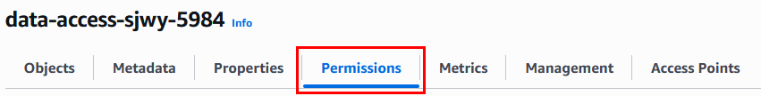
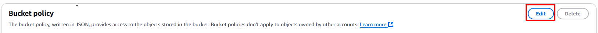

# Práctica 9: Configuración de permisos y acceso público/privado en Amazon S3

## Objetivo

Aprender a configurar políticas de acceso en Amazon S3, estableciendo:
- Acceso privado predeterminado a todo el bucket.
- Acceso público **selectivo** a archivos específicos.
- Pruebas de acceso desde el navegador y validaciones de seguridad.

## Requisitos Previos

- Usuario IAM con permisos sobre Amazon S3 (`s3:*`)
- Tener un bucket disponible (ej. `data-access-jorge-202507`)
- Archivo local de ejemplo (ej. `catalogo_publico.pdf`)

## Duración aproximada

- 40 minutos

## Región de AWS

- us-west-2 (Oregón)

---

**[⬅️ Atrás](https://netec-mx.github.io/TPRACT_INGDAT_Priv/Capítulo4/lab8.html)** | **[Lista General](https://netec-mx.github.io/TPRACT_INGDAT_Priv/)** | **[Siguiente ➡️](https://netec-mx.github.io/TPRACT_INGDAT_Priv/Capítulo6/lab10.html)**

---

## Instrucciones

## Tarea 1: Iniciar sesión en la consola AWS

**Descripción:** Acceder como usuario IAM.

### Tarea 1.1

- **Paso 1.** Ir a [AWS Console](https://aws.amazon.com/console)

- **Paso 2.** Clic en **Sign in**

- **Paso 3.** Iniciar sesión con:

  - Account ID or alias: `Cuenta asignada en el curso`
  - IAM username: `Asignado en el curso`
  - Password: `Asignada en el curso`

- **Paso 4.** Verificar que estás en la región `us-west-2`

    

> **TAREA FINALIZADA**

**Resultado esperado:** Acceso exitoso a la consola.

---

## Tarea 2: Revisar configuración de acceso público del bucket

### Tarea 2.1

- **Paso 1.** Abrir el servicio **Amazon S3**

  

- **Paso 2.** Clic en **"Create bucket"**

  

- **Paso 3.** En el nombre del bucket sustiuye el las `x` por letras aleatorias y el simbolo `#` por numeros:

  - **Region**: `US West (Oregon) - us-west-2`
  - **Bucket type**: `General purpose`
  - **Bucket name**: `data-access-xxxx-####` (ej. `data-access-pctm-202507`)
  
  ---

  

- **Paso 4.** Haz clic en **"Create bucket"**

- **Paso 5.** Dentro de S3, haz clic en el bucket recién creado.

  

- **Paso 6.** Ir a pestaña **Permissions**

  

- **Paso 7.** Revisar sección **Block public access (bucket settings)**

  

  **NOTA:** Por defecto está **bloqueado completamente** (recomendado), no se podrá compartir objetos sin ajustar estas opciones.

> **TAREA FINALIZADA**

**Resultado esperado:** Saber si puedes permitir acceso público selectivo a objetos.

---

## Tarea 3: Cargar archivo privado

### Tarea 3.1

- **Paso 1.** Da clic en la pestaña **Objects**

  

- **Paso 2.** Descarga el siguiente archivo PDF para la demostración de politicas.

  Descargar ---> [Controlling Access to S3 Resources.pdf](https://s3.us-west-2.amazonaws.com/labs.netec.com/courses/TallerPracIngDatos/ControllingAccesstoS3Resources.pdf)

- **Paso 3.** Si ya tienes listo el archivo da clic en **Upload**

  

- **Paso 4.** Selecciona el archivo PDF y cargalo.

  

- **Paso 5.** Da clic en **Upload** y luego clic en **Close**.

- **Paso 6.** Selecciona el archivo y copia la **Object URL** dando clic en el botón **Copy URL**.

  

### Tarea 3.2 – Validar acceso sin permisos

- **Paso 7.** Abre el navegador en modo incógnito o en privado y pega la URL en una pestaña.:

  

- **Paso 8.** El resultado es **AccessDenied**.

> **TAREA FINALIZADA**

**Resultado esperado:** Acceso denegado (`Access Denied`) si no está configurado para público.

---

## Tarea 4: Hacer público un objeto específico

### Tarea 4.1

- **Paso 1.** Regresa a la consola de S3 y da clic **Permissions**

- **Paso 2.** Da clic en la opción **Edit** de la sección **Block public access (bucket settings).

  

- **Paso 3.** Desmarca la opción **Block all public access**.

  

- **Paso 4.** Da clic en **Save changes**. 

- **Paso 5.** En el cuadro de texto escribe: `confirm` y clic en el botón **confirm**.

  

### Tarea 4.2

- **Paso 6.** Regresa a la sección de **Objects** de S3 y da clic en el nombre del archivo `Controlling Access to S3 Resources.pdf`

  

- **Paso 7.** Clic en la pestaña **Permissions** del objeto.

  

- **Paso 8.** Ahora da clic en la opción **bucket owner enforced**

  

- **Paso 9.** Da clic en la opción **ACLs enabled**, confirma la casilla **Iacknowledge that ACLs will be restored** y clic en **Save changes**

  

- **Paso 10.** Ahora apareceras en la sección de **Permissions** del bucket. Clic en la sección **Objects** -> **Objecto** -> **Permissions**

- **Paso 11.** Selecciona **"Edit"** → sección **Public access**

  

- **Paso 12.** Marca las 2 casillas de la sección **Everyone (public access)** y confirma la casilla **I understand the effects...**

  

- **Paso 13.** Clic en **Save changes**

> **TAREA FINALIZADA**

**Resultado esperado:** Se realizo la configuració que da acceso publicamente al objecto. No es recomendable los permisos abiertos

---

## Tarea 5: Validar acceso público desde navegador

### Tarea 5.1

- **Paso 1.** Abre nuevamente el **Object URL** desde una ventana incógnita

- **Paso 2.** Actualiza el navegador y verifica que ahora sí se puede acceder al objeto.

  

- **Paso 3.** Comparte la URL con algun colaborador para validar el acceso desde cualquier lugar.

> **TAREA FINALIZADA**

**Resultado esperado:** El archivo ahora es accesible públicamente.

---

## Tarea 6: Reforzar configuración privada del bucket (bloquear todo)

### Tarea 6.1

- **Paso 1.** Ve a la pestaña **Permissions** del bucket.

- **Paso 2.** En la sección **Block Public Access (bucket settings)**, haz clic en **Edit**

  

- **Paso 3.** Marca la casilla **Block all public access** y da clic en **Save changes**

  

- **Paso 4.** En el cuadro de texto escribe: `confirm` y clic en el botón **confirm**.

  

- **Paso 5.** Puedes validar el acceso a la URL, nuevamente **AccessDenied**

### Tarea 6.2

- **Paso 6.** En la misma sección de **Permissions** identifica la sección de **Bucket policy**

  

- **Paso 7.** Da clic en la opción **Edit**.

  

- **Paso 8.** Con mucho cuidado copia la siguiente politica a un bloc de notas.

  ```json
  {
    "Version": "2012-10-17",
    "Statement": [
      {
        "Sid": "DownloadObject",
        "Effect": "Allow",
        "Principal": {
          "AWS": "arn:aws:iam::TU-CUENTA:user/TU-USUARIO"
        },
        "Action": "s3:Get*",
        "Resource": [
          "arn:aws:s3:::NOMBRE-DEL-BUCKET",
          "arn:aws:s3:::NOMBRE-DEL-BUCKET/*"
        ]
      },
      {
        "Sid": "DeleteObject",
        "Effect": "Deny",
        "Principal": {
          "AWS": "arn:aws:iam::TU-CUENTA:user/TU-USUARIO"
        },
        "Action": "s3:DeleteObject",
        "Resource": [
          "arn:aws:s3:::NOMBRE-DEL-BUCKET",
          "arn:aws:s3:::NOMBRE-DEL-BUCKET/*"
        ]
      }
    ]
  }
  ```

- **Paso 9.** Ahora en el bloc de notas, edita los siguientes valores:

  - TU-CUENTA: `Numero de cuenta asignado al curso`
  - TU-USUARIO: `Nombre del usuario asignado al curso`
  - NOMBRE-DEL-BUCKET: `Nombre del bucket creado en esta practica`

- **Paso 10.** Ya editada la politica, copiala y pegala en S3, debera quedar parecida a esta:

  **NOTA:** No copiar esta politica es solo un ejemplo, No editar ningun otro valor.

  

- **Paso 11.** Clic en el botón **Save changes**

- **Paso 12.** Ahora ve a la sección **Objects** selecciona el objecto, da clic en **Download**.

  

- **Paso 13.** El objeto debera ser descargado correctamente gracias a la politica.

- **Paso 14.** Mante seleccionado el objeto y da clic en **Delete**.

  

- **Paso 15.** En el campo de texto escribe: `permanently delete` y da clic en **Delete objects**

  

- **Paso 16.** El resultado sera **Access denied** gracias a la politica nos otorga protección.

  

> **TAREA FINALIZADA**

**Resultado esperado:** Esto **revocará acceso público a nivel de bucket y objetos**, incluso si los objetos tienen permisos públicos.

---

## Tarea 7: Validar acceso tras bloquear público

### Tarea 7.1

- **Paso 1.** Intenta acceder a la URL en la pestaña incognito.

- **Paso 2.** El acceso deberia de ser revocado.

- **Paso 3.** Intenta compartir la URL a algun colaborador para ver el comportamiento.

> **TAREA FINALIZADA**

**Resultado esperado:** Debe mostrar “Access Denied” nuevamente.

---

> **¡FELICIDADES HAZ COMPLETADO EL LABORATORIO 9!**

## Resultado final

- Se comprendió el control de acceso público y privado en S3.
- Se cargó un archivo y se probó su visibilidad desde navegador.
- Se habilitó acceso público selectivo y luego se revocó.
- El bucket quedó seguro, sin exponer otros objetos de forma no deseada.

---

## URLS de referencia

- [Controlar el acceso público en S3](https://docs.aws.amazon.com/AmazonS3/latest/userguide/access-control-block-public-access.html)
- [Compartir objetos públicamente](https://docs.aws.amazon.com/AmazonS3/latest/userguide/ShareObjectPreSignedURL.html)
- [Cómo funcionan los permisos de objetos](https://docs.aws.amazon.com/AmazonS3/latest/userguide/s3-access-control.html)
- [Gestión de políticas de acceso en S3](https://docs.aws.amazon.com/AmazonS3/latest/userguide/example-bucket-policies.html)

---

**[⬅️ Atrás](https://netec-mx.github.io/TPRACT_INGDAT_Priv/Capítulo4/lab8.html)** | **[Lista General](https://netec-mx.github.io/TPRACT_INGDAT_Priv/)** | **[Siguiente ➡️](https://netec-mx.github.io/TPRACT_INGDAT_Priv/Capítulo6/lab10.html)**