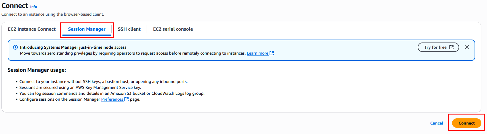
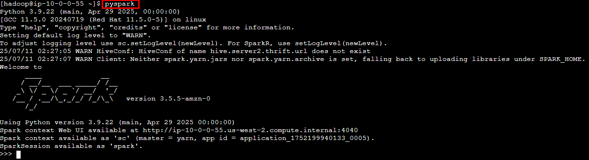

# Práctica 10: Configuración de un Cluster de EMR

## Objetivo

Lanzar un clúster EMR en AWS desde la consola, configurado para procesamiento de datos con Apache Spark, validando su estado, configuraciones y seguridad. Esta práctica sienta las bases para procesar grandes volúmenes de datos distribuidos.

## Requisitos

- Tener una cuenta de AWS activa.
- Contar con un usuario IAM con las siguientes políticas adjuntas:
  - `AmazonEMRFullAccessPolicy`
  - `AmazonEC2FullAccess`
  - `IAMFullAccess`


## Duración aproximada

- 30 minutos

## Región de AWS

- us-west-2 (Oregón)

---

**[⬅️ Atrás](https://netec-mx.github.io/TPRACT_INGDAT_Priv/Capítulo4/lab9.html)** | **[Lista General](https://netec-mx.github.io/TPRACT_INGDAT_Priv/)** | **[Siguiente ➡️](https://netec-mx.github.io/TPRACT_INGDAT_Priv/Capítulo6/lab11.html)**

---

## Instrucciones

## Tarea 1: Iniciar sesión en la consola AWS

**Descripción:** Acceder como usuario IAM.

### Tarea 1.1

- **Paso 1.** Ir a [AWS Console](https://aws.amazon.com/console)

- **Paso 2.** Clic en **Sign in**

- **Paso 3.** Iniciar sesión con:

  - Account ID or alias: `Cuenta asignada en el curso`
  - IAM username: `Asignado en el curso`
  - Password: `Asignada en el curso`

- **Paso 4.** Verificar que estás en la región `us-west-2`

    

> **TAREA FINALIZADA**

**Resultado esperado:** Acceso exitoso a la consola.

---

## Tarea 2: Crear un clúster EMR manual con Apache Spark

**Descripción:** Crear un clúster con componentes base (Spark, Hadoop y otros)

### Tarea 2.1 – Ingresar a EMR

- **Paso 1.** En el buscador de servicios, escribe **emr** y selecciona **Amazon EMR**

  

- **Paso 2.** Selecciona **Amazon EMR running on Amazon EC2** y haz clic en **Create cluster**

  **Nota:** Puede que solo aparezca el botón **Create cluster**

  

### Tarea 2.2 – Software y componentes

- **Paso 3.** Dentro de la sección **Create cluster**, configura solo los parámetros definidos en la siguiente tabla. También puedes apoyarte en la imagen que está más abajo.

  **NOTA:** Recuerda sustituir las `x` por letras y numeros aleatorios.

  | Parametro | Valor |
  | --------- | ----- |
  | Cluster Name | `emr-lab-cluster-xxxx` |
  | Amazon EMR release | emr-7.9.0 |
  | Application bundle | Hadoop, Spark, Livy, Hive y JupyterEnterpriseGateway |

  ---

  

### Tarea 2.3 – Hardware

- **Paso 4.** Ahora, en la sección **Cluster configuration**, define los siguientes valores de la tabla.

  | Parametro | Valor |
  | --------- | ----- |
  | Uniform instance groups | **Seleccionado** |
  | Primary | m5.xlarge |
  | Core | m5.xlarge |
  | Task 1 of 1 | Clic en **Remove instance group** |

  ---

  

- **Paso 5.** En la sección **Cluster scaling and provisioning - required** configura lo siguiente.

  | Parametro | Valor |
  | --------- | ----- |
  | Set cluster size manually | **Seleccionado** |
  | Instance(s) size | **2** |

  ---

  

### Tarea 2.4 – Networking

- **Paso 6.** En la sección **Networking - required** configura lo siguiente.

  | Parametro | Valor |
  | --------- | ----- |
  | Virtual private cloud (VPC) | Clic en **Browse** y selecciona **LabVPC** |
  | Subnet | Clic en **Browse** y selecciona **Public Subnet 1** |
  
  ---

  

  ---

  

### Tarea 2.5 – Key Pair

- **Paso 7.** En la sección **Security configuration and EC2 key pair** configura la siguiente propiedad.

  | Parametro | Valor |
  | --------- | ----- |
  | Amazon EC2 key pair for SSH to the cluster | Clic en **Browse** y selecciona **llave-jupyter** |

  ---
  
  


### Tarea 2.6 – Identity and Access Management (IAM) roles

- **Paso 8.** En la sección **Amazon EMR service role** da clic en **Choose an existing service role** y luego del menú desplegable **EMR-Role**

  

- **Paso 9.** Para la sección **EC2 instance profile for Amazon EMR** selecciona **Choose an existing instance profile** y luego del menú desplegable **EMR-InstRole**

  

- **Paso 10.** Clic en el botón **Create cluster**

  **NOTA:** El cluster tarda en promedio al rededor de **2 a 7 minutos**.

> **TAREA FINALIZADA**

**Resultado esperado:** Clúster en estado `Starting` y luego `Waiting`.

---

## Tarea 3: Validar el estado y configuración del clúster

**Descripción:** Confirmar que el clúster fue creado correctamente y se encuentra activo.

### Tarea 3.1 – Seguimiento desde EMR

- **Paso 1.** Ve al listado de clústeres EMR

  

- **Paso 2.** Espera a que el clúster pase a estado: `Waiting`

  

- **Paso 3.** Da clic en el nombre del cluster, observa los detalles:

  

### Tarea 3.2 – Validar el acceso a EMR

- **Paso 4.** En la sección de **Summary** da clic en la opción **Connect to the Primary node using SSM**

  

- **Paso 5.** Ahora selecciona la pestaña **Session Manager** y da clic en el botón **Connect**

   

- **Paso 6.** Deberias poder conectarte al servidor.

  

- **Paso 7.** Por el momento no se usara el cluster, solo se validara que se pueda acceder correctamente a **Spark**

- **Paso 8.** Ahora ya estás en la sesión remota de tu servidor de EMR, escribe o copia el siguiente comando para inicializar la sesión con Apache Hadoop.

  ```bash
  sudo su - hadoop
  ```

  ---

  

- **Paso 9.** Ya dentro de **Hadoop** ahora escribe el siguiente comando.

  ```bash
  pyspark
  ```
  
  ---

  

- **Paso 10.** Hagamos un pequeño ejemplo para corroborar que todo funciona bien. Copia y pega en la terminal de **pyspark**

  ```python
  data = [("Juan", 34), ("Ana", 28), ("Luis", 45)]
  df = spark.createDataFrame(data, ["nombre", "edad"])

  df.show()
  ```

  ---

  

- **Paso 11.** Tendras el resultado de un **Dataframe**.

  

- **Paso 12.** Si el tiempo alcanza dentro de la sesión puedes dejar el cluster creado, sino elimina el cluster. y en la proxima sesion se creara de nuevo.

> **TAREA FINALIZADA**

**Resultado esperado:** Clúster en estado `Waiting`, componentes listos, acceso correcto y prueba exitosa con PySpark.

---

> **¡FELICIDADES HAZ COMPLETADO EL LABORATORIO 10!**

## Resultado final

- Se creó un clúster EMR con Spark y Hadoop en AWS.
- Se validó el estado operativo, componentes instalados y conectividad de red.
- Se valido el funcionamiento del cluster con PySpark
- El entorno está listo para ejecutar jobs de Spark, ETL con PySpark, o análisis en siguientes prácticas.

---

## Notas y/o Consideraciones

- **Importante:** Este clúster genera costos por hora. Si no se usa en prácticas futuras, **debes terminarlo manualmente** desde el panel EMR → Actions → Terminate.
- Puedes usar este clúster para conectarte vía SSM y ejecutar comandos Spark en línea de comandos.
- Para mayor seguridad, puedes aplicar roles más restrictivos y control granular de acceso a S3.
- Es posible automatizar este procedimiento usando Amazon EMR Studio, EMR Notebooks o herramientas como AWS CloudFormation.

---

## URLS de referencia

- [Amazon EMR: Documentación oficial](https://docs.aws.amazon.com/emr/latest/ManagementGuide/emr-what-is-emr.html)
- [Conectar por SSH a nodos EMR](https://docs.aws.amazon.com/emr/latest/ManagementGuide/emr-connect-master-node-ssh.html)
- [Spark en EMR – Introducción](https://docs.aws.amazon.com/emr/latest/ReleaseGuide/emr-spark.html)

---

**[⬅️ Atrás](https://netec-mx.github.io/TPRACT_INGDAT_Priv/Capítulo4/lab9.html)** | **[Lista General](https://netec-mx.github.io/TPRACT_INGDAT_Priv/)** | **[Siguiente ➡️](https://netec-mx.github.io/TPRACT_INGDAT_Priv/Capítulo6/lab11.html)**