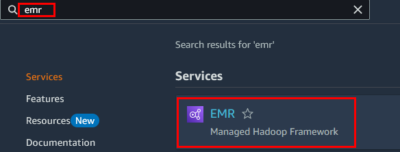
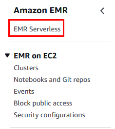
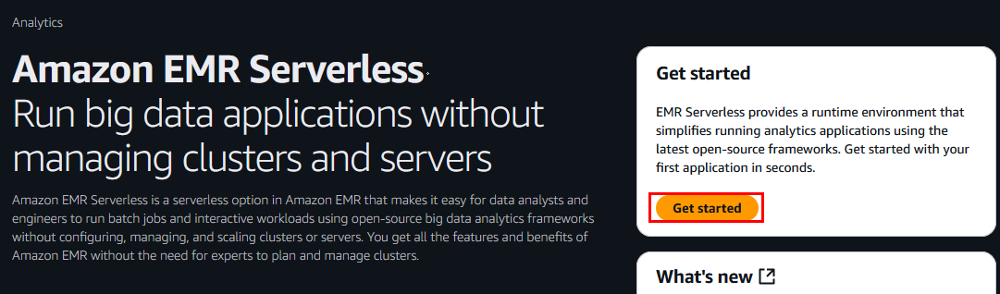
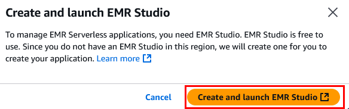
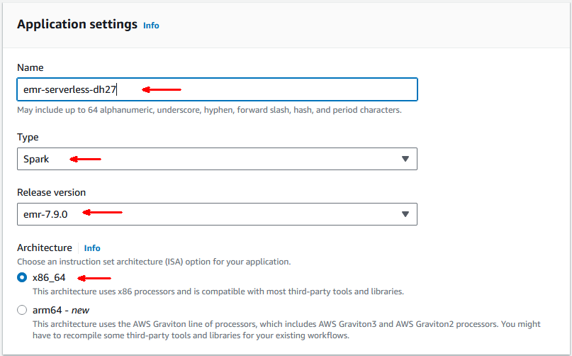
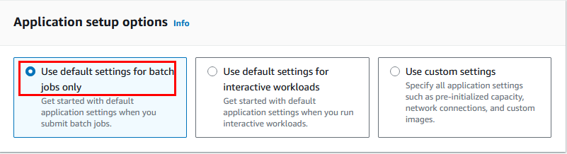
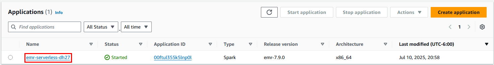
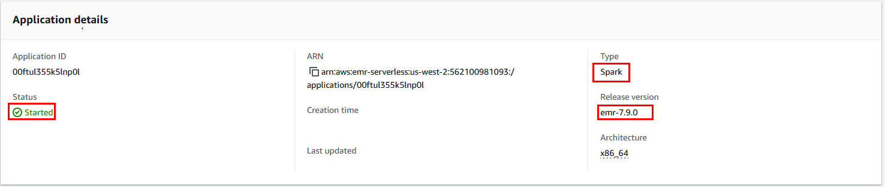

# Práctica 11: Configuración de un Cluster Serverless de EMR

## Objetivo

Configurar y lanzar un entorno de Amazon EMR Serverless para ejecutar aplicaciones Spark de forma escalable y sin necesidad de administrar clústeres. Esta práctica permite a los ingenieros de datos optimizar recursos y costos en cargas de trabajo eventuales o bajo demanda.

## Requisitos Previos

- Usuario IAM con permisos para trabajar con EMR Serverless:
  - `AmazonEMRServerlessFullAccess`
  - `IAMFullAccess`
  - `S3FullAccess`
- Bucket S3 disponible para almacenamiento de datos
- Rol de ejecución EMR Serverless o permisos para crearlo

## Duración aproximada

- 30 minutos

## Región de AWS

- us-west-2 (Oregón)

---

**[⬅️ Atrás](https://netec-mx.github.io/TPRACT_INGDAT_Priv/Capítulo6/lab10.html)** | **[Lista General](https://netec-mx.github.io/TPRACT_INGDAT_Priv/)** | **[Siguiente ➡️](https://netec-mx.github.io/TPRACT_INGDAT_Priv/Capítulo6/lab12.html)**

---

## Instrucciones

## Tarea 1: Iniciar sesión en la consola AWS

**Descripción:** Acceder como usuario IAM.

### Tarea 1.1

- **Paso 1.** Ir a [AWS Console](https://aws.amazon.com/console)

- **Paso 2.** Clic en **Sign in**

- **Paso 3.** Iniciar sesión con:

  - Account ID or alias: `Cuenta asignada en el curso`
  - IAM username: `Asignado en el curso`
  - Password: `Asignada en el curso`

- **Paso 4.** Verificar que estás en la región `us-west-2`

    

> **TAREA FINALIZADA**

**Resultado esperado:** Acceso exitoso a la consola.

---

## Tarea 2: Crear una aplicación EMR Serverless

**Descripción:** Crear una aplicación lógica que define el runtime de procesamiento sin necesidad de aprovisionar clústeres EC2.

### Tarea 2.1 – Acceder a EMR Serverless

- **Paso 1.** En el buscador de servicios, escribe **emr** y selecciona **Amazon EMR**

  

- **Paso 2.** En el menú lateral izquierdo selecciona la opcioón  **EMR Serverless**

  

- **Paso 3.** Ahora da clic en el botón **Get started**.

  

- **Paso 4.** En la ventana emergente confirma la opción **Create and launch EMR Studio**

  

### Tarea 2.2 – Configurar aplicación

- **Paso 5.** En **Application Settings** configura lo siguiente:

  **NOTA:** Recuerda sustituir las `x` por letras y numeros aleatorios.

  | Parametro | Valor |
  | --------- | ----- |
  | Name | `emr-serverless-xxxx` |
  | Type | `Spark` |
  | Release version | `emr-7.9.0` |
  | Architecture | `x86_64` |

  ---

  

- **Paso 6.** En la sección **Aplication setup options** da clic en **USe default settings for batch jobs only**:

  

- **Paso 7.** El resto de los valores quedara por defecto y da clic en **Create and start application**

> **TAREA FINALIZADA**

**Resultado esperado:** Se crea una nueva aplicación EMR Serverless en estado `Created`.

---

## Tarea 3: Validar la aplicación y su estado

**Descripción:** Revisar que la aplicación fue creada correctamente y está lista para usarse.

### Tarea 3.1

- **Paso 1.** En el panel de EMR Serverless, localiza la aplicación y da clic en el nombre.

  

- **Paso 2.** Verifica los detalles del panel llamado **Application details**.

  - Estado: `Started`
  - Release version: `emr-6.15.0`
  - Type: `Spark`

  ---

  

- **Paso 3.** Por el momento el cluser serverless no se usara, hasta la siguiente practica

> **TAREA FINALIZADA**

**Resultado esperado:** La aplicación está en estado `Started` y lista para ejecutar tareas.

---

> **¡FELICIDADES HAZ COMPLETADO EL LABORATORIO 11!**

## Resultado final

- Se creó una aplicación EMR Serverless sin necesidad de instancias EC2
- Se configuró con Spark como runtime
- El entorno quedó listo para ejecutar jobs de PySpark, ETL o procesamiento de datos desde S3

---

## Notas y/o Consideraciones

- EMR Serverless no genera costos hasta que se envía un job.
- Las aplicaciones pueden permanecer creadas indefinidamente, pero solo incurren en cargos al ejecutarse.
- Este entorno es ideal para cargas intermitentes, controladas desde scripts, CLI, Step Functions o Workflows.
- En prácticas siguientes puedes cargar un archivo `.py` a S3 y ejecutar jobs Spark directamente.

---

## URLS de referencia

- [Amazon EMR Serverless – Documentación oficial](https://docs.aws.amazon.com/emr/latest/EMR-Serverless-UserGuide/what-is-emr-serverless.html)
- [Creación de una aplicación EMR Serverless desde la consola de EMR Studio](https://docs.aws.amazon.com/emr/latest/EMR-Serverless-UserGuide/studio.html)
- [Ejemplos de políticas de acceso de usuarios para EMR Serverless](https://docs.aws.amazon.com/emr/latest/EMR-Serverless-UserGuide/security-iam-user-access-policies.html)
- [Estados de ejecución del trabajo](https://docs.aws.amazon.com/emr/latest/EMR-Serverless-UserGuide/job-states.html)

---

**[⬅️ Atrás](https://netec-mx.github.io/TPRACT_INGDAT_Priv/Capítulo6/lab10.html)** | **[Lista General](https://netec-mx.github.io/TPRACT_INGDAT_Priv/)** | **[Siguiente ➡️](https://netec-mx.github.io/TPRACT_INGDAT_Priv/Capítulo6/lab12.html)**