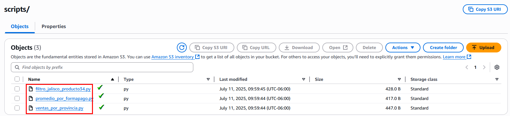
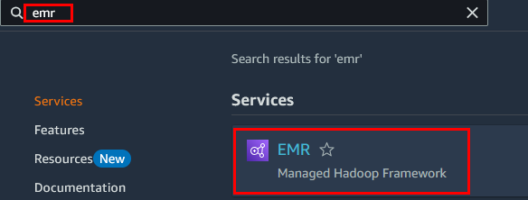
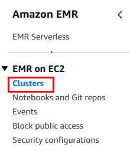
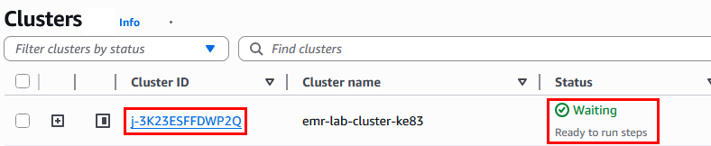
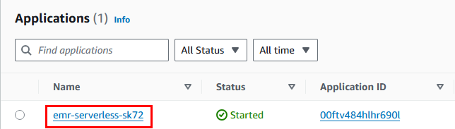
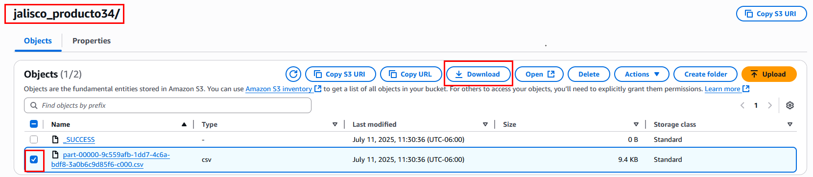

# Práctica 12: Desarrollo de un procesamiento utilizando Pyspark en EMR

## Objetivo

Desarrollar múltiples scripts PySpark que procesen datos desde un archivo CSV en S3 y los almacenen transformados en rutas diferentes. Los scripts se ejecutarán tanto en un clúster EMR EC2 como en una aplicación EMR Serverless para comparar desempeño, costo y flexibilidad.

## Requisitos

- Bucket S3: `lab-databucket-xxxx`
  - Contiene: `data/ventas.csv`
- Clúster EMR con EC2 (activo)
- Aplicación EMR Serverless ya creada
- Usuario IAM con permisos:
  - `AmazonEMRFullAccess`
  - `AmazonEMRServerlessFullAccess`
  - `AmazonS3FullAccess`
  - `IAMPassRole`

## Duración aproximada

- 120 minutos

## Región de AWS

- us-west-2 (Oregón)

---

**[⬅️ Atrás](https://netec-mx.github.io/TPRACT_INGDAT_Priv/Capítulo6/lab11.html)** | **[Lista General](https://netec-mx.github.io/TPRACT_INGDAT_Priv/)** | **[Siguiente ➡️](https://netec-mx.github.io/TPRACT_INGDAT_Priv/Capítulo8/lab13.html)**

---

## Instrucciones

## Tarea 1: Iniciar sesión en la consola AWS

**Descripción:** Acceder como usuario IAM.

### Tarea 1.1

- **Paso 1.** Ir a [AWS Console](https://aws.amazon.com/console)

- **Paso 2.** Clic en **Sign in**

- **Paso 3.** Iniciar sesión con:

  - Account ID or alias: `Cuenta asignada en el curso`
  - IAM username: `Asignado en el curso`
  - Password: `Asignada en el curso`

- **Paso 4.** Verificar que estás en la región `us-west-2`

    

> **TAREA FINALIZADA**

**Resultado esperado:** Acceso exitoso a la consola.

---

## Tarea 2: Crear y subir múltiples scripts PySpark

**Descripción:** Crear 3 scripts distintos y subirlos a la carpeta `scripts/` en S3.

### Tarea 2.1 – Script 1: Agrupación por Provincia

- **Paso 1.** En tu computadora crea un archivo llamado `ventas_por_provincia.py`, te mucho cuidado en la extensión del archivo sino no funcionara.

    

- **Paso 2.** Edita el archivo con tu software preferido de edicion. y agrega el siguiente contenido. Aún no lo guardes.

  ```python
  from pyspark.sql import SparkSession

  spark = SparkSession.builder.appName("VentasPorProvincia").getOrCreate()

  df = spark.read.csv("s3://lab-databucket-xxxx/data/ventas.csv", header=True, inferSchema=True)

  df_clean = df.dropna(subset=["Unidades"])

  df_grouped = df_clean.groupBy("Provincia").sum("Unidades", "PrecioUd")

  df_grouped.write.csv("s3://lab-databucket-xxxx/output/ventas_por_provincia/", header=True, mode="overwrite")
  ```

- **Paso 3.** Modifica las letras `x` en el nombre del bucket por las que se te asignaron al curso.

    

- **Paso 4.** Ahora si guarda el archivo.

---

### Tarea 2.2 – Script 2: Promedios por Forma de Pago

- **Paso 5.** En tu computadora crea un archivo llamado `promedio_por_formapago.py`, te mucho cuidado en la extensión del archivo sino no funcionara.

  

- **Paso 6.** Edita el archivo con tu software preferido de edicion. y agrega el siguiente contenido. Aún no lo guardes.

  ```python
  from pyspark.sql import SparkSession

  spark = SparkSession.builder.appName("PromedioFormaPago").getOrCreate()

  df = spark.read.csv("s3://lab-databucket-xxxx/data/ventas.csv", header=True, inferSchema=True)

  df_clean = df.dropna()

  df_avg = df_clean.groupBy("FormaPago").avg("Unidades", "PrecioUd")

  df_avg.write.csv("s3://lab-databucket-xxxx/output/promedio_formapago/", header=True, mode="overwrite")
  ```

- **Paso 7.** Modifica las letras `x` en el nombre del bucket pr las que se te asignaron al curso.

  

- **Paso 8.** Guarda el archivo.

---

### Tarea 2.3 – Script 3: Filtrar por Provincia y Artículo

- **Paso 9.** En tu computadora crea un archivo llamado `filtro_jalisco_producto34.py`, te mucho cuidado en la extensión del archivo sino no funcionara.

  

- **Paso 10.** Edita el archivo con tu software preferido de edicion. y agrega el siguiente contenido. Aún no lo guardes.

  ```python
  from pyspark.sql import SparkSession

  spark = SparkSession.builder.appName("FiltroJaliscoProducto34").getOrCreate()

  df = spark.read.csv("s3://lab-databucket-xxxx/data/ventas.csv", header=True, inferSchema=True)

  df_filtered = df.filter((df["Provincia"] == "Jalisco") & (df["Articulo"] == "Producto-34"))

  df_filtered.write.csv("s3://lab-databucket-xxxx/output/jalisco_producto34/", header=True, mode="overwrite")
  ```

- **Paso 11.** Modifica las letras `x` en el nombre del bucket pr las que se te asignaron al curso.

  

- **Paso 12.** Al final debes tener 3 archivos

  

### Tarea 2.4 – Subir los scripts

- **Paso 13.** En la Consola de AWS busca el servicio de **S3**.

  

- **Paso 14.** Da clic en el nombre del bucket que empieza con `lab-databucket-xxxx`.

  

- **Paso 15.** Da clic en la opción **Create folder**

- **Paso 16.** Escribe el nombre de la carpeta: `scripts`

  

- **Paso 17.** Da clic en **Create folder**

- **Paso 18.** Muy bien, entra a la carpeta llamada **scripts** y da clic en el botón **Upload**

  

- **Paso 19.** Agrega los 3 archivos que creaste anteriorimente.

  

- **Paso 20.** Clic en el botón **Upload** y luego en **Close**.

  

> **TAREA FINALIZADA**

**Resultado esperado:** Los scripts están disponibles en S3 listos para su ejecución.

---

## Tarea 3: Ejecutar los scripts en EMR EC2

**Descripción:** Agregar steps al clúster EMR EC2 existente para cada script.

### Tarea 3.1 – Accede a tu clúster EC2

- **Paso 1.** En la consola, ve a **EMR > Clusters**

  

  ---

  

- **Paso 2.** Clic en el nombre del cluster en estado `Waiting`.

  **NOTA:** El estado puede variar, pero elige el cluster que tengas creado activo.

  

### Tarea 3.2 – Agregar steps - Step 1

- **Paso 3.** Ve a la pestaña llamada **Steps** y da clic en el botón **Add Step**.

  

- **Paso 4.** Selecciona el tipo de aplicación **Spark application**

  

- **Paso 5.** Escribe el nombre: `ventasprovincia`

  

- **Paso 6.** En la seción **Application location** da clic en el boton **Browse**

  

- **Paso 7.** Navega a la ruta **lab-databucket-xxx** --> **scripts** --> **ventas_por_provincia.py**

  

- **Paso 8.** Da clic en el botón **Choose**

- **Paso 9.** Al final da clic en el botón **Add step**

- **Paso 10.** Verifica la ejecución del job. Duración aproximada de **1 minuto a 1.30 minutos**

  

- **Paso 11.** Revisa que el estado final del job sea **Completed**. 

### Tarea 3.3 – Agregar steps - Step 2

- **Paso 12.** Agrega otro Step.

  

- **Paso 13.** Selecciona el tipo de aplicación **Spark application**

  

- **Paso 14.** Escribe el nombre: `promformapago`

  

- **Paso 15.** En la seción **Application location** da clic en el boton **Browse**

  

- **Paso 16.** Navega a la ruta **lab-databucket-xxx** --> **scripts** --> **promedio_por_formapago.py**

    

- **Paso 17.** Da clic en el botón **Choose**

- **Paso 18.** Al final da clic en el botón **Add step**

- **Paso 19.** Verifica la ejecución del job. Duración aproximada de **1 minuto a 1.30 minutos**

  

- **Paso 20.** Revisa que el estado final del job sea **Completed**.

- **Paso 21.** Todos los Steps deben ejecutarse correctamente.

  

- **Paso 22** El tecer step sera ejecutado mediante **EMR Serverless** en la siguiente tarea.

> **TAREA FINALIZADA**

**Resultado esperado:** Todos los steps finalizan con estado `COMPLETED`.

---

## Tarea 4: Ejecutar el script en EMR Serverless

**Descripción:** Ejecutar el ultimo script en EMR Serverless

### Tarea 4.1 – Ir a la aplicación

- **Paso 1.** En la consola, entra a **EMR Serverless** y da clic en **Manage applications**

  **NOTA:** Sino tienes el cluster creado repite la **Práctica 11**

  

  ---

  

- **Paso 2.** Da clic en el nombre de tu aplicación: `emr-serverless-xxxx`

  

### Tarea 4.2 – Agregar Job - Job 3

- **Paso 3.** Clic en la pestaña **Batch job runs**.

  

- **Paso 4.** Ahora clic en la flecha del lado derecho del botón **Submit batch job run** y luego **Submit job run**

  

- **Paso 5.** En la propiedad **Name** escribe: `filtroproducto`

  

- **Paso 6.** En **Runtime role** selecciona **Create a new role**

- **Paso 7.** En la ventana emergente configura **All buckets in this account** y clic en **Create role**

  

- **Paso 8.** En la seción **Script location** da clic en el boton **Browse**

  

- **Paso 9.** Navega a la ruta **lab-databucket-xxx** --> **scripts** --> **filtro_jalisco_producto34.py**

  

- **Paso 10.** Da clic en el botón **Choose**

- **Paso 11.** Al final da clic en el botón **Submit job run**

- **Paso 12.** Verifica la ejecución del job. Duración aproximada de **2 minutos a 3 minutos**

  

- **Paso 13.** Job ejecutaro correctamente.

  

> **TAREA FINALIZADA**

**Resultado esperado:** El job debe aparecer como `Success`.

---

## Tarea 5: Validar salidas en S3

**Descripción:** Comprobar que los resultados fueron generados en S3.

### Tarea 5.1

- **Paso 1.** Ve a la interfaz de tu servicio de Amazon S3.

- **Paso 2.** Selecciona el bucket que inicia con **lab-databucket-xxx**

- **Paso 3.** Notaras una carpeta nueva llamada **output** que se genero desde el primer script y el resto de los scripts la actualizaba. 

  

- **Paso 4.** Da clic en el nombre de la carpeta y notras 3 carpetas mas generadas uno por cada script.

  

- **Paso 5.** Selecciona 1 por 1 y descarga el archivo **.csv** a tu computadora.

  

- **Paso 6.** Repite el proceso del **Paso 5** por cada una de las otras carpetas y archivos **.csv**

- **Paso 7.** Contenido del archivo de la carpeta **ventas_por_provincia/** 

  

- **Paso 8.** Contenido del archivo de la carpeta **promedio_formapago/** 

  

- **Paso 9.** Contenido del archivo de la carpeta **jalisco_producto34/**.

  **NOTA:** La captura muestra pocas celdas, pero en el archivo son mas.

  

> **TAREA FINALIZADA**

**Resultado esperado:** Resultados escritos en S3 desde ambos entornos con los archivos `.csv` presentes y datos filtrados.

---

> **¡FELICIDADES HAZ COMPLETADO EL LABORATORIO 12!**

## Resultado final

- Se ejecutaron 3 scripts diferentes en dos tipos de ejecución EMR
- Se generaron resultados correctos y separados en rutas organizadas
- Se observaron diferencias de flujo entre EMR EC2 y Serverless

---

## Notas y/o Consideraciones

- Puedes usar Glue o Step Functions para automatizar este flujo completo.
- Las salidas pueden reescribirse usando fechas o particiones para evitar sobreescritura.
- Ideal para procesamiento batch, exploración analítica, o pipelines de datos.

---

## URLS de referencia

- [PySpark – API completa](https://spark.apache.org/docs/latest/api/python/)
- [EMR Serverless – Jobs](https://docs.aws.amazon.com/emr/latest/EMR-Serverless-UserGuide/start-job-run.html)
- [Amazon S3 – Subida de objetos](https://docs.aws.amazon.com/AmazonS3/latest/userguide/upload-objects.html)

---

**[⬅️ Atrás](https://netec-mx.github.io/TPRACT_INGDAT_Priv/Capítulo6/lab11.html)** | **[Lista General](https://netec-mx.github.io/TPRACT_INGDAT_Priv/)** | **[Siguiente ➡️](https://netec-mx.github.io/TPRACT_INGDAT_Priv/Capítulo8/lab13.html)**