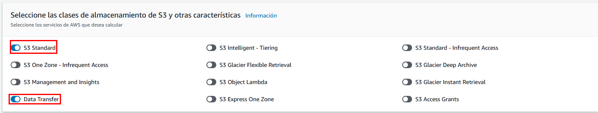

# Práctica 13: Uso de la Calculadora de Precios de AWS (Servicios previos)

## Objetivo

Estimar el costo mensual de una arquitectura de ingeniería de datos realista en AWS, basada en los servicios que ya usamos previamente:

- **Amazon S3**
- **AWS Lambda**
- **EMR con EC2**
- **EMR Serverless**

Usaremos la **Calculadora de Precios de AWS** para validar costos, entender su impacto y exportar un reporte detallado.

---

## Requisitos

- Navegador web actualizado
- Usuario IAM con acceso a la consola y la calculadora de precios
- Infraestructura ya existente:
- Conexión a internet

---

## Duración aproximada

- 20 minutos

---

## Región de AWS

- us-west-2 – Oregon

---

**[⬅️ Atrás](https://netec-mx.github.io/TPRACT_INGDAT_Priv/Capítulo6/lab12.html)** | **[Lista General](https://netec-mx.github.io/TPRACT_INGDAT_Priv/)** | **[Siguiente ➡️](https://netec-mx.github.io/TPRACT_INGDAT_Priv/Capítulo8/lab14.html)**

---

## Instrucciones

## Tarea 1: Iniciar sesión en la consola AWS

**Descripción:** Acceder como usuario IAM.

### Tarea 1.1

- **Paso 1.** Ir a [AWS Console](https://aws.amazon.com/console)

- **Paso 2.** Clic en **Sign in**

- **Paso 3.** Iniciar sesión con:

  - Account ID or alias: `Cuenta asignada en el curso`
  - IAM username: `Asignado en el curso`
  - Password: `Asignada en el curso`

- **Paso 4.** Verificar que estás en la región `us-west-2`

    

> **TAREA FINALIZADA**

**Resultado esperado:** Acceso exitoso a la consola.

---

## Tarea 2: Acceder a la AWS Pricing Calculator

**Descripción:** Crear una nueva estimación.

### Tarea 2.1

- **Paso 1.** Entrar a: [AWS Calculator](https://calculator.aws/#/)

- **Paso 2.** Clic en **Create estimate**

    

> **TAREA FINALIZADA**

**Resultado esperado:** Estimación lista para agregar servicios.

---

## Tarea 3: Agregar y configurar servicios

### Tarea 3.1 – Amazon S3

- **Paso 1.** Filtra en el campo de busqueda y añade el  servicio **S3** dando clic en el botón **configurar**

    

- **Paso 2.** Cambia la rgion Oregón: `us-west-2`

     

- **Paso 3.** Selecciona solo las opciones **S3 Standard** y **Data Transfer**

  **NOTA:** Despues puedes jugar con las opciones para estimaciones mas profundas

     

- **Paso 4.** Ingresar los siguientes datos:

  - Almacenamiento de S3 Estándar: `500` 
  - Unidad: `GB por mes`
  - Solicitudes PUT, COPY, POST y LIST a S3 Standard: `200 000` PUT requests
  - Solicitudes GET, SELECT y todas las demás desde S3 Estándar: `1 000 000` GET requests

  ---

  

- **Paso 5.** El resto de los valores quedara por defecto.

- **Paso 6.** Observa la esquina inferior izquierda el monto aproximado es **12.90 USD**

  **NOTA:** El monto del costo puede variar

  

- **Paso 7.** Ahora da clit en el botón **Guardar y agregar servicio**

  

**Resultado esperado:** S3 aparece con el costo calculado por GB y requests.

---

### Tarea 3.2 – AWS Lambda

- **Paso 8.** Filtra en el campo de busqueda y añade el  servicio **Lambda** dando clic en el botón **configurar**.

  

- **Paso 9.** Configura los siguientes parámetros:
  - Cantidad de solicitudes: `3 000 000` 
  - Unidad: `por mes`
  - Duración de cada solicitud (en ms): `200`
  - Cantidad de memoria asignada: `512`
  - Unidad: `MB`

  ---

  

- **Paso 10.** Observa la esquina inferior izquierda el monto aproximado es **0.40 USD**

  **NOTA:** El monto del costo puede variar

  

- **Paso 11.** Ahora da clit en el botón **Guardar y agregar servicio**

  

**Resultado esperado:** Lambda se agrega con costos por invocaciones y tiempo de ejecución.

---

### Tarea 3.3 – EMR con EC2

- **Paso 12.** Filtra en el campo de busqueda y añade el  servicio **Amazon EMR** dando clic en el botón **configurar**.

  

- **Paso 13.** Selecciona las opciones **Amazon EMR master node on EC2** y **Amazon EMR core node on EC2**

  

- **Paso 14.** Configura los siguientes parámetros de la sección **Seleccione la instancia de EMR del nodo maestro**:

  - Cantidad de nodos maestros de EMR: `1`
  - Instancia EC2: `m5.xlarge`
  - Utilización: `100`
  - Unidad: `%Utilized/Month`

  ---

  

- **Paso 15.** Configura los siguientes parámetros de la sección **Seleccione la instancia de EMR del nodo principal**:

  - Cantidad de nodos principales de EMR: `2`
  - Instancia EC2: `m5.xlarge`
  - Utilización: `100`
  - Unidad: `%Utilized/Month`

  ---

  

- **Paso 16.** Observa la esquina inferior izquierda el monto aproximado es **105.12 USD**

  **NOTA:** El monto del costo puede variar

  

- **Paso 17.** Ahora da clit en el botón **Guardar y agregar servicio**

  

**Resultado esperado:** Costo por EC2, EBS y gestión EMR visible en el resumen.

---

### Tarea 3.4 – EMR Serverless

- **Paso 18.** Filtra en el campo de busqueda y añade el  servicio **Amazon EMR** dando clic en el botón **configurar**.

  

- **Paso 19.** Selecciona las opciones **Amazon EMR Serverless**

  

- **Paso 20.** Configura los siguientes parámetros:

  - Cantidad de CPU virtuales por ejecución de trabajo: `4`
  - Cantidad de memoria por ejecución de trabajo (GB): `16`
  - Almacenamiento efímero total por ejecución de trabajo (GB): `20`
  - Tiempo de ejecución del trabajo: `100`
  - Unidad: `horas`

  ---

  

- **Paso 21.** Observa la esquina inferior izquierda el monto aproximado es **105.12 USD**

  **NOTA:** El monto del costo puede variar

  

- **Paso 22.** Ahora da clit en el botón **Guardar y agregar servicio**

  

> **TAREA FINALIZADA**

**Resultado esperado:** Costos calculados por vCPU-segundo y GB-segundo.

---

## Tarea 4: Revisión y exportación de la estimación

**Descripción:** Validar los costos para cada servicio y generar un reporte.

### Tarea 4.1

- **Paso 1.** Clic en **View Summary** en la parte inferior derecha.

  

- **Paso 2.** Da clic en el icono de edición. Asigna el nombre: `Estimación_Arquitectura_IngDatos` y da clic en el botón **Guardar**

  

  ---

  

- **Paso 3.** Revisa que todos los servicios incluyan sus costos calculados, analiza la información y desglose de costos.

  

- **Paso 4.** Puedes exportar tu reporte en el formato que mas sea adecuado, dando clic en la opción **Exportar**

  

- **Paso 5.** Guarda el reporte como: `Estimacion_LabIngDatos_SinRedshift.pdf`

> **TAREA FINALIZADA**

**Resultado esperado:** Documento PDF con el resumen mensual por servicio.

---

## Resultado final

- Se creó una estimación completa basada en servicios realmente utilizados:
  - S3, Lambda, EMR EC2, EMR Serverless
- Se generó y descargó un reporte en PDF con costos estimados
- Se obtuvo claridad sobre cómo cada servicio impacta el gasto

---

## Notas y/o Consideraciones

- Esta estimación no incluye tráfico de salida ni almacenamiento Glacier
- La duración real del clúster EMR se puede refinar según uso real
- EMR Serverless es más económico para cargas intermitentes frente a EMR EC2
- Usar la versión exportable para conversarlo con stakeholders

---

## URLS de referencia

- [AWS Pricing Calculator](https://docs.aws.amazon.com/pricing-calculator/latest/userguide/what-is-pricing-calculator.html)
- [Amazon S3 Pricing](https://aws.amazon.com/s3/pricing/)
- [AWS Lambda Pricing](https://aws.amazon.com/lambda/pricing/)
- [Amazon EMR Pricing](https://aws.amazon.com/emr/pricing/)
- [Amazon EMR Serverless cost estimator](https://aws.amazon.com/blogs/big-data/amazon-emr-serverless-cost-estimator/)
- [Comparación EC2 vs Serverless](https://aws.amazon.com/emr/serverless/#comparison)

---

**[⬅️ Atrás](https://netec-mx.github.io/TPRACT_INGDAT_Priv/Capítulo6/lab12.html)** | **[Lista General](https://netec-mx.github.io/TPRACT_INGDAT_Priv/)** | **[Siguiente ➡️](https://netec-mx.github.io/TPRACT_INGDAT_Priv/Capítulo8/lab14.html)**