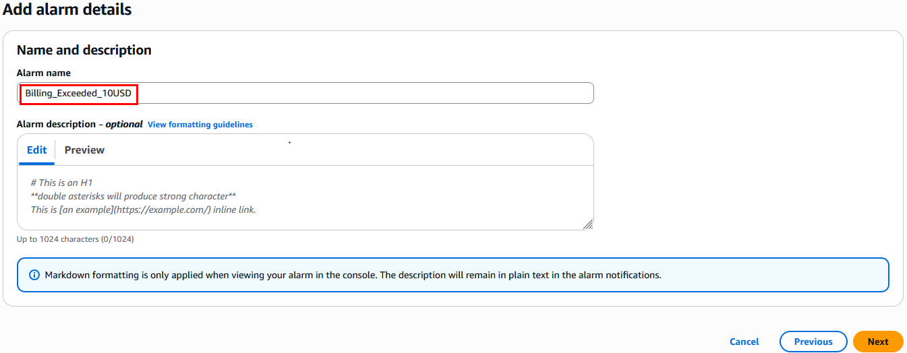

# Práctica 14: Creación de alertas en CloudWatch para controlar los costos

## Objetivo

Configurar en AWS CloudWatch una alarma basada en métricas de facturación y definir un presupuesto en AWS Budgets, de modo que se active una notificación vía correo electrónico cuando el gasto se acerque a los límites planificados.

---

## Requisitos

- Usuario IAM con permisos mínimos:
  - `cloudwatch:PutMetricAlarm`
  - `billing:ViewBilling`
  - `sns:CreateTopic`, `sns:Subscribe`, `sns:Publish`
  - `budgets:CreateBudget`, `budgets:ViewBudget`
- Correo empresarial o personal para alertas
- Esta practica se configurara en `us-east-1 - N. Virginia`

---

## Duración aproximada

20 minutos

---

## Región de AWS

- `us-east-1 - N. Virginia` – región obligatoria para métricas de facturación y presupuestos

---

**[⬅️ Atrás](https://netec-mx.github.io/TPRACT_INGDAT_Priv/Capítulo8/lab13.html)** | **[Lista General](https://netec-mx.github.io/TPRACT_INGDAT_Priv/)** | **[Siguiente ➡️](https://netec-mx.github.io/TPRACT_INGDAT_Priv/Capítulo2/lab1.html)**

---

## Instrucciones

## Tarea 1: Iniciar sesión en la consola AWS

**Descripción:** Acceder como usuario IAM.

### Tarea 1.1

- **Paso 1.** Ir a [AWS Console](https://aws.amazon.com/console)

- **Paso 2.** Clic en **Sign in**

- **Paso 3.** Iniciar sesión con:

  - Account ID or alias: `Cuenta asignada en el curso`
  - IAM username: `Asignado en el curso`
  - Password: `Asignada en el curso`

- **Paso 4.** Verificar que estás en la región `us-west-2`

    

> **TAREA FINALIZADA**

**Resultado esperado:** Acceso exitoso a la consola.

---

## Tarea 2 (Demostrativa): Habilitar métricas de facturación si no lo has hecho

**Descripción:** Activar métricas de facturación para que CloudWatch pueda leerlas.

### Tarea 2.1

  **IMPORTANTE: Esta tarea solo es demostrativa, en las cuentas de laboratorio no se podra realizar por `Información Confidencial` de la cuenta y control de la cuenta maestra `(AWS Organizations)`. Estos pasos pueden servirte para aplicarlos en tus propias cuentas.**

- **Paso 1.** En el menú de AWS de tu usuario autenticado, da clic en **Billing and Cost Management**

    

- **Paso 2.** En la barra lateral hasta el finla, selecciona **Billing Preferences**

    

- **Paso 3.** En **Alert preferences** da clic en el botón **Edit**

    

- **Paso 4.** Activa la casilla **Receive CloudWatch billing alerts**

  

- **Paso 5.** Clic en el botón **Update**

**NOTA:** Recuerda que esta tarea no se podra realizar en la cuenta, solo es demostrativa.

> **TAREA FINALIZADA**

**Resultado esperado:** Billing Alerts activados y métricas `/EstimatedCharges` disponibles en CloudWatch

---

## Tarea 3 (Demostrativa): Crear un tópico SNS y suscripción por correo

**Descripción:** Configurar el canal de notificación para las alertas.

### Tarea 3.1

- **Paso 1.** Ve a **Amazon SNS** desde el menú de busqueda.

  

- **Paso 2.** Da clic en la opcion **Start with an overview**

  

- **Paso 3.** Da clic en la opción **Topics** del menu lateral izquierdo.

  

- **Paso 4.** Clic en **Create topic**

  

- **Paso 5.** Configura lo siguiente:

  - Type: `Standard`
  - Name: `alert-costs-topic`
  - Display name - optional: `alert-costs-topic`

  ---

  

- **Paso 6.** Clic en el botón **Create topic**

- **Paso 7.** En el tópico recién creado, haz clic en **Create subscription**

  

- **Paso 8.** Configura lo siguiente:

  **NOTA:** El correo puede ser empresarial o personal, debees poder recibir correos de AWS.

  - Protocol: `Email`
  - Endpoint: tu correo (ej. `tucorreo@ejemplo.com`)

  ---

  

- **Paso 9.** Clic en **Create Subscription**.

- **Paso 9.** Revisa tu bandeja y **confirma la suscripción** a través del email recibido.

> **TAREA FINALIZADA**

**Resultado esperado:** Tópico SNS activo con suscripción validada

---

## Tarea 4 (Demostrativa): Crear una alarma de CloudWatch para detectar exceso de costos

**Descripción:** Configurar un umbral de alerta basado en métricas Billing.

### Tarea 4.1

- **Paso 1.** En el buscador de AWS, escribe **CloudWatch** para acceder al servicio.

  

- **Paso 2.** En el menú lateral da clic en  **Alarms** y luego **All alarms**.

  

- **Paso 3.** Clic en **Create alarm**

  

- **Paso 4.** Selecciona la métrica, da clic en **Select metric**.

  

- **Paso 5.** Identifica el namespace de la metrica llamada **Billing** y da clic en el nombre.

  **NOTA IMPORTANTE: En caso de que no aparezca la metrica `Billing` es por restricción e `Información Confidencial`. Toma los siguientes pasos como `demostrativos`**

  

- **Paso 6.** Da clic en **Total Estimated Charge (USD)**

  

- **Paso 7.** Da clic en la casilla **USD**

  

- **Paso 8.** Clic en **Select metric**

- **Paso 9.** En la sección **Conditions**, establece:

  - Threshold type: `Static`
  - Whenever EstimateCharges is...: `Greater/Equal`
  - than...: `10` (USD)

  ---

  

- **Paso 10.** Clic en **Next**

- **Paso 11.** En la sección **Notification** configura lo siguiente:

  - Alarm state trigger: `In alarm`
  - Send a notification to the following SNS topic: `Select an existing SNS topic`
  - Send a notification to...: `alert-costs-topic` Tu topico creado

  

- **Paso 12.** Clic en **Next**

- **Paso 13.** Nombre de la alarma: `Billing_Exceeded_10USD`

  

- **Paso 14.** en la sección **Preview and create** confirma las configuraciones y da clic en **Create alarm**

> **TAREA FINALIZADA**

**Resultado esperado:** Alarma activa que detecta gastos mayores a $10/mes y notifica vía email

---

## Tarea 5: Crear un presupuesto con AWS Budgets

**Descripción:** Configurar un presupuesto mensual con umbrales y notificaciones. Se recomienda su uso es mas reciente y mejor que CloudWatch Billing Alarms

**NOTA:** Dentro de la interfaz, podrias encontrar recursos creados puedes ignorarlos y realizar los pasos de la tarea.

### Tarea 5.1

- **Paso 1.** En el menú de AWS de tu usuario autenticado, da clic en **Billing and Cost Management**

  

- **Paso 2.** Navega a la opcion **Budgets** de la sección **Budgets and Planning**

  

- **Paso 3.** Da clic en el botón **Create budget**

  

- **Paso 4.** En la opción **Budget setup** selecciona **Use a template (simplified)

  

- **Paso 5.** En la sección **Templates** selecciona **Monthly cost budget**

  

- **Paso 6.** En la seccion **Monthly cost budget - Template** configura lo siguiente

  - Budget name: `Monthly_Data_Infra_Budget`
  - Enter your budgeted amount ($): `100`
  - Email recipients: `tucorreo@example.com` Escribe un correo valido personal o laboral.
  
  ---

  

- **Paso 8.** Revisa y haz clic en **Create budget**

- **Paso 9.** Budget correctamente configurado.

  

> **TAREA FINALIZADA**

**Resultado esperado:** Presupuesto activo que notificará al superar 85% del $100 asignado

---

## Resultado final

- Tópico SNS con suscripción por correo verificada
- Alarma en CloudWatch para gastos > $10/mes
- Presupuesto mensual activado con alerta al alcanzar 80%

---

## Notas y/o Consideraciones

- La evaluación de métricas Billing en CloudWatch tarda hasta 24 horas
- Umbrales y políticas pueden ajustarse según el uso real
- Budgets permite agrupar por etiquetas (por proyecto o servicio)
- Combinar con acciones automáticas (ej. Lambda) para bloqueo de recursos

---

## URLS de referencia

- [CloudWatch Billing Alarms – AWS Docs](https://docs.aws.amazon.com/AmazonCloudWatch/latest/monitoring/monitor_estimated_charges_with_cloudwatch.html)
- [AWS Budgets – Guía del usuario](https://docs.aws.amazon.com/cost-management/latest/userguide/budgets-managing-costs.html)
- [Crear presupuesto AWS](https://docs.aws.amazon.com/cost-management/latest/userguide/budgets-create.html)
- [Amazon SNS – Introducción](https://docs.aws.amazon.com/sns/latest/dg/welcome.html)
